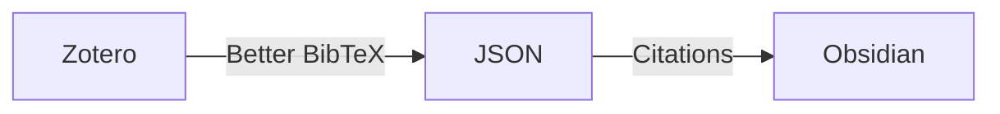
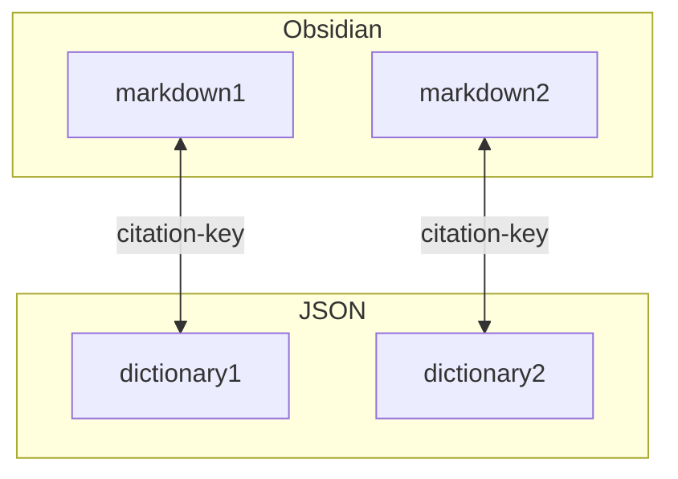

# はじめに

Citationsは文献データを含むノートをObsidian内に作成するコミュニティプラグインで、Obsidianで文献管理を行う際に便利
ZoteroからObsidianに文献データをインポートしてObsidian上で文献を管理できる
他に[Zotero Integration](https://github.com/mgmeyers/obsidian-zotero-integration)や[ZotLit](https://github.com/PKM-er/obsidian-zotlit)が同様の機能を提供している
この2つはZoteroのAnnotationsを取り込むなど、より多機能になっている
ただ、より設定が煩雑そうに見えるので、今のところシンプルなCitationsを採用している



全体のワークフローは別記事にて

> [!seealso] Seealso
> [[Zotero×Obsidian 文献管理のすゝめ]]

# テンプレート

Citationsではテンプレートに則って文献ノートを作成する
ホットキーを押すと文献検索画面が出現して、選ぶだけで文献ノートが完成する

[GitHubの公式ページより](https://github.com/hans/obsidian-citation-plugin)


なので、**テンプレート作成が非常に重要**
このテンプレートを基に文献を管理するからである
↓これは初期に作成したもの

```
---
title: "{{title}}"
authors: {{authorString}}
journal: {{containerTitle}}
year: {{year}}
doi: "[Go To Article](https://doi.org/{{DOI}})"
zotero: "[Go To Zotero]({{zoteroSelectURI}})"
---
[Go To Article](https://doi.org/{{DOI}})
[Go To Zotero]({{zoteroSelectURI}})
```

Zoteroや元文献まで飛ぶリンクを作ったり、必要なものを揃えたつもり
ただ、しばらく使っているとこうすればよかったなと言う部分も少なからず出てくる
今作るなら↓のようにしたい

```
---
aliases: "{{title}}"
tags: []
title: "{{title}}"
description: ""
authors: [{{authorString}}]
journal: "{{containerTitle}}"
year: {{year}}
doi: https://doi.org/{{DOI}}
zotero: {{zoteroSelectURI}}
---
```

結局フロントマターにメタデータを登録するだけで良いと思う
それぞれ登録理由は以下

- aliases
	- Obsidian公式サポートのプロパティ
	- 検索やWikiLinkを貼るときにaliasesに登録した名称でも使用可能になる
	- titleを登録しておくと検索性があがる
- tags
	- これも公式サポートのプロパティ
	- 文献はtagでの分類が一番適している気がする
	- [Tag Wrangler](https://github.com/pjeby/tag-wrangler)という別のコミュニティプラグインにより取回しがかなり良くなる
- title
	- 文献のタイトルなので必須
- description
	- これは自分で入力する部分
	- 短い要約を登録しておくと後からかなり見やすくなる
	- 最初はcommentにしていたが、Webサイトでも使用される名称にした
- authors
	- 著者なので必須
	- 前後を`[]`で囲むと配列として認識されるので、First Authorの抽出ができるようになる
- journal
	- journal名なので必須
- year
	- 出版年なので必須
- doi
	- `https://doi.org/`にdoiをつけると原著論文までアクセスできる
	- 前はマークダウンリンクにしていたが、そのままで良いと思う
- zotero
	- Zoteroへのリンク
	- 以前はマークダウンリンクにしないとリンクと認識されなかったが、Obsidianがプロパティをサポートし始めてからはそのままでも良くなった

# テンプレートを一括で更新する

Citationsは一個ずつ文献データをノートに変換する機能は有しているが、上記のようにテンプレートを変更しようと考えても対応できない
ただ、CitationsはデフォルトだとJSONファイルの中のcitation-keyという項目を元にノートのタイトルを作成しているので、**Pythonなどのプログラム言語で簡単に一括変更できるのでは**と考えてみた

Pythonは環境構築が結構難しいので、今回はGoogle Colaboratoryを使用する
[Colaboratory へようこそ - Colaboratory](https://colab.research.google.com)
Google ColaboratoryはGoogleアカウントされあればページを開くだけでPythonの実行環境を使えるという神がかったサービス

基本的な使い方は省くが、コードを書いて再生マークを押すだけで実行できる

## Google Driveに文献ファイルとJSONファイルをアップロード

まずGoogleDriveにアップロード
~~これだけしかファイル入っていなくて全然GoogleDrive使ってないことが発覚した~~


## Google ColaboratoryでGoogle Driveをマウント

Google ColaboratoryからGoogleDriveにアクセスできるようにする
↓のコードを実行

```python
# Google Driveをマウント（同期）
from google.colab import drive
drive.mount('/content/drive')
```

認証画面が出るので同意する

## フロントマターの更新

フロントマターの更新コード
ファイルパスは適当に自分のファイル名に変える必要がある
↓のコードを実行

```python
import json # JSONファイルを扱うモジュール
import yaml # YAMLを扱うモジュール
from pathlib import Path # Pathを扱うモジュール
import re # 正規表現モジュール

# JSONファイルのパス
json_file_path = '/content/drive/MyDrive/マイ・ライブラリ.json'

# マークダウンファイルがあるディレクトリのパス
markdown_dir_path = '/content/drive/MyDrive/05_Zotero sync'

# JSONファイルを読み込む
with open(json_file_path, 'r', encoding='utf-8') as json_file:
    citations = json.load(json_file) # 辞書リストを変数citationsに格納

# マークダウンファイルを処理する部分から抜粋
for md_file_path in Path(markdown_dir_path).glob('*.md'):
    original_key = md_file_path.stem.lstrip('@')  # ファイル名から@を抜いてオリジナルキーを取得
    modified_key = re.sub(r'[a-z]$', '', original_key)  # 末尾のアルファベットを削除して修正キーを取得

    # citationsリストから、original_keyまたはmodified_keyに一致する最初の辞書を抽出
    citation = next((item for item in citations if item.get('citation-key') in [original_key, modified_key]), None)

    if citation:  # citationがNoneでない場合のみ処理を続ける
        with open(md_file_path, 'r', encoding='utf-8') as md_file:
            content = md_file.read() # mdファイルを開いて変数contentに中身を格納
            front_matter_end = content.find('---', 1) # 2回目の"---"がフロントマター終了位置と定義
            if front_matter_end != -1: # フロントマター終了位置が存在した場合
                front_matter = yaml.safe_load(content[3:front_matter_end]) # ---に囲まれた部分をfront_matterと定義
                body = content[front_matter_end+3:] # front_matterの終わりから先をbodyと定義
            else: # フロントマターが存在しない場合
                front_matter = {} # 空のフロントマターを定義
                body = content # contentがそのままbodyに

        # 年の取得を try-except ブロックで行う
        try:
          year = int(citation['issued']['date-parts'][0][0])
        except (KeyError, IndexError, TypeError):
          year = None  # エラーがあれば空文字を設定

        # フロントマターの更新
        front_matter['aliases'] = [citation.get('title','')]
        front_matter['title'] = citation.get('title','')
        front_matter['description'] = ""
        front_matter['authors'] = [f"{author.get('given')} {author.get('family')}" for author in citation.get('author', [])]
        front_matter['year'] = year
        front_matter['doi'] = 'https://doi.org/' + citation.get('DOI','')
        front_matter['zotero'] = 'zotero://select/items/@' + citation.get('id','')

        # マークダウンファイルの形式に変換して変数updated_contentに格納
        updated_content = '---\n' + yaml.safe_dump(front_matter, allow_unicode=True, sort_keys=False) + '---\n' + body

        # updated_contentを元のファイルに書き込む
        with open(md_file_path, 'w', encoding='utf-8') as md_file:
            md_file.write(updated_content)
```

このフロントマターの更新という所をいじれば自由に設定できる
更新されたフォルダをダウンロードしてObsidianのVaultに追加して終了

## 仕組み

まずJSONの構造は文献ごとの辞書データが羅列された構造になっている
各辞書の構造はJSONファイルを開けば分かるが以下の通り

- id: Zotero内で使用されているID
- abstract
- accessed
	- date-parts
		- year
		- month
- author
	- family, given
	- family, given
	- ...
- citation-key: 外部からのアクセス用のkey(idと同値)
- container-title
- DOI
- ISSN
- issue
- issued
	- date-parts
		- year
		- month
- page
- PMID
- publisher
- title
- type
- URL

**著者情報が姓名別で登録されている**ことと、**日付情報が入れ子になっていて取り出しにくい**のでそこだけ別処理を挟まなければいけない

また、Citationsで取り込んだmarkdownファイルはファイル名がデフォルトでは`@citation-key`になっている
ファイル名から@を除いたものをkeyとしてcitation-keyが一致する辞書をJSONファイルから検索する
ただ、**Zoteroでは重複アイテムがあったときにcitation-keyの末尾にaとかbとかのアルファベットをつける**ので統合処理を行っていた場合どっちが残っているかが分からない
そのため末尾のアルファベットを除くパターンも同時に検索する



対応した辞書から取得した情報をフロントマターに書き込む
この時、**更新する項目は消えるが、更新しない項目や本文は残る**

これを全てのファイルに実行する繰り返し処理を行う

# Dataview Tableのテンプレート

最後にDataviewで表示させるときのテンプレを更新
最近はタグで分類するのとDataview Tableをコールアウトで囲むのがマイブーム

```
> [!summary]
>
> ```dataview
> table without id
> "[Note](" + file.name + ")" as Note, authors[0] as FirstAuthor, journal, year, title, description, "[Zotero](" + zotero + ")" as Zotero, "[DOI](" + doi + ")" as DOI
> from #タグ名  and "文献フォルダ名"
> sort year desc
> ```
```

![[Pasted image 20240208222514.png]]

いい感じになった！

# おわりに

フロントマターでメタデータを管理すると必ず決まった形式で書き込まれるので、編集が容易だと思った
テキストベースの処理なので時間もそんなにかからないのはマークダウンの強み
最近はコードはChat-GPTに聞いたら分かるので、ロジックを考えるだけでいいし、一般人でもプログラミングを便利に使えるのは凄い
