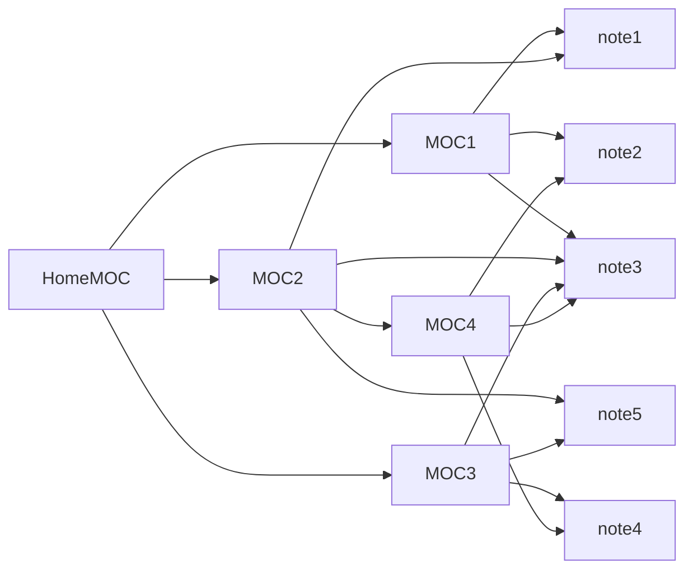

# はじめに

Obsidianを使用する上で欠かせない概念がMOCであるが、最初は概念の理解が難しいと思う
ここに私なりの解釈・運用法を記録しておくことにする

# MOCとは


ObsidianではMap of Contents(MOC)というノートの管理方法を行う
MOCはノートへのリンク集のようなノートであり、コンテンツを含むノートとは明確に区別される

私が思うにMOCの最も優れた利点は**異なる構造が同時に存在できる点**だろう
ノートの重複支配やMOC同士の回帰的な構造を許容する

フォルダ構造はわかりやすいがどこに分類するのか迷うときがある
「どこのフォルダに入れたっけ？」ってことが頻発する
タグでの管理は複数の分類が同時に存在できるが、階層構造を作ることは難しい
プロパティによるデータベース管理は数学的なルールにしか従うことができない

それらの問題をMOCでは回避できる
さらにObsidianではフォルダやタグやプロパティなどの機能も使用できるので、MOCをベースに他の管理方法を併用することも可能である

# 私のMOCマイルール

MOCは自由に作れる分、面倒になりやすい
ある程度決まったルールを決めておくと良いのではと思った

```
# categoly1
[[note1]]
[[note2]]
[[note3]]

# categoly2
[[note4]]
[[note5]]
[[note6]]

# [[categoly3]]
```

これは私のMOCの記載方法の例である
私のマイルールは

> [!tip] Rule
> 1. 作成したノートを必ずどこかのMOCにリンクとして貼る
> 2. ノートをh1セクションで分類する
> 3.  h1セクション上のノートが10個以上になったらh1セクション自体をリンクにして新たなMOCとする

これを繰り返すだけである
MOCへのリンクは必ずh1セクション上に存在するのでコンテンツのノートとは一目で区別される
また、セクションで分類するとアウトラインでドラッグすることで順番の入れ替えが容易になるので整理もしやすい

このように育てたノートやMOCを、気づいたところにリンクさせていくことでさらに使用感が増していくはず

# おわりに

MOCの運用法は調べると色々出てくるが、大体みんな違う
どうしようかと最初は思ったが、みんな違ってもちゃんとworkするほどに自由度が高いのだと解釈した
黒曜石とはよく言ったもので、徐々に使いやすくしていきたい