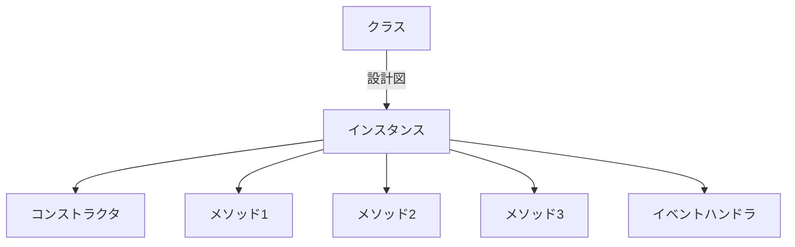

# はじめに

最近 Templater にだいぶ入れ込んでいた

> [!NOTE] seealso
> 
> - [[アウトラインで英文を書く|📘アウトラインで英文を書く]]
> - [[Templaterでoutlinerを強化|📘Templaterでoutlinerを強化]]
> - [[Templaterの結果を特定のセクションに出力|📘Templaterの結果を特定のセクションに出力]]
> - [[ObsidianでBibliography付き文書を作成|📘ObsidianでBibliography付き文書を作成]]

だいぶいろいろできるようになってきてふと思ったのが、

｢これってほぼ Templater 自体の機能使ってなくない？｣

ほぼコピペでコミュニティプラグインにできるんじゃないかと思って、ちょっとやってみた

# 情報収集

まず、検索してみた

- [Build a plugin - Developer Documentation](https://docs.obsidian.md/Plugins/Getting+started/Build+a+plugin)
- [ゼロから始めるObsidianプラグイン開発-01](https://zenn.dev/estra/articles/obsidian-plugin-dev_1)
- [Obsidianプラグインの作り方 - あるSEのつぶやき・改](https://www.aruse.net/entry/2023/11/05/150958)

公式ドキュメントが十分分かりやすい感じだったけど、検索して出てきたページはざっと目を通した

どうやら Sample Plugin のリポジトリを git clone して npm install して編集していくらしい
この最初の流れ...Quartz でやったやつだ...

# 実際の作成 

細かい手順は省略

実際の作成の際は、main.ts というファイルを編集するだけで良い様子
main.ts は TypeScript で書かれている
全然知らないけど、多分 Templater と同じ感じだろう

main.ts の基本構造は

1. クラスのインポート
2. 設定値の型を決める
3. 設定のデフォルト値を決める
4. プラグインの本体
5. モーダル (ポップアップウィンドウ的な？) の設定
6. 設定画面の UI

と区画で分かれている

なので、コマンドの追加だけなら 4 の部分をいじるだけで良い
5 は削除した
Templater のスクリプトをここにコピペして、ちょっと調整したらすぐ使用可能になった

# 新しい知識を得た

クラスとかインスタンスとか、便利そうなので GPT 先生や Google 先生に聞いてみた



クラスからインスタンスを作ってメソッドとかを管理しているっぽい
コンストラクタは初期化時の動作で、イベントハンドラは何かの動きに連動して動くメソッドみたいな
コマンドの追加は基本的にはロード時のイベントハンドラで addcommand するようにしている様子
インスタンスがプラグインの本体

**じゃあメソッドで処理を管理すれば重複コードほぼなくせるしメンテが楽っていうことだろう**

GPT 先生や Google 先生に聞くと簡単な構造や文法は教えてくれるので、それを元に調整...
めっちゃシンプルになる

```ts
// get lines
const lines = await this.splitContent();

// get indent levels list
let indentLevels = this.calculateIndentLevels(lines);

// transform & connect
let result = this.transformLines(lines, indentLevels, this.headerLevel2, this.doubleLinebreak, this.ignoreLine, this.addSpace, this.extractPandoc)

// adjust pandoc style
result = this.adjustPandoc(result);

// copy the result to clipboard
navigator.clipboard.writeText(result);

// output
this.outputToSection(editor, lines, this.settings.sectionName, result);
```

これはアウトラインを Pandoc Style にした文章にして出力するコマンドの内容
別のところに method を作っておいて呼び出して組み合わせるみたいな使い方ができるので、滅茶苦茶流用できる

1. ノートの内容を改行で分割して文字列のリストにする
2. 文字列のリストからインデントレベルを計算してリストを取得する
3. 上記 2 つのリストからインデントレベル低い順に、”h2 ヘッダーにする”、”改行 2 回”、" 無視 "、" スペースを入れるだけ "、" 文献ノートを Pandoc style として抽出 " というメソッドをそれぞれ適応する
4. Pandoc style を調整する
5. クリップボードにコピー
6. 指定のセクションに出力する

みたいな感じ
調整したり、再利用できるのが便利 (何回も言う)

# 一旦完成 

メソッドを再利用して一括 fold のコマンドも追加したり、設定から値取ったりするのも作った

設定の値使おうと思うと設定の UI 作らないといけないのがだいぶだるい
逆に、普通にコマンド追加するだけだったらかなり簡単だった


リポジトリ↓↓
[GitHub - masaki39/outline-converter: Convert outline to continuous text.](https://github.com/masaki39/outline-converter)

<iframe src=https://github.com/masaki39/outline-converter></iframe>

公開はされていないが、BRAT でβ版としてインストールできる
URL↓入れたら一応コミュニティプラグインとして入れれるようになった

```
https://github.com/masaki39/outline-converter
```

# おわりに 

まず、私のプログラミング経験は R とか Python で簡単なデータ分析くらい
TypeScript は初めてで Git も初めて
Templater はドキュメント読みながら、ちょっとずつ使えるようになってきていた
それでもコミュニティプラグイン化するまでは 1 日でできたので、Obsidian のプラグイン出すまでのフローはだいぶ簡素化されているように思った

プラグイン化して管理するメリットはとにかく流用できることと、管理が楽なこと
追加機能欲しいときや編集するときにだいぶ楽な気がする

Templater にはまったら、次のステップはコミュニティプラグイン化なのかなと思った
