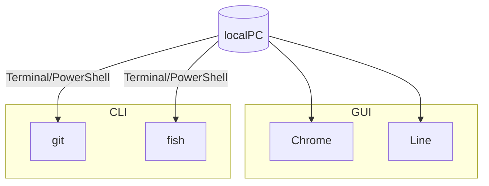
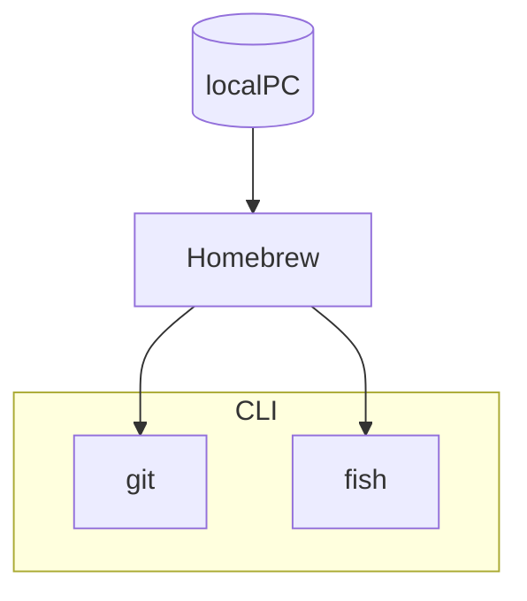

# はじめに

Obsidianの1番の問題は同期
私はAppleユーザーなのでiCloudで同期させていたが、iCloudだと同期が間に合わずにconflictした際にmergeする機能がなくてノートが増えてしまう
単一のノートがノート、ノート2、ノート3みたいになる

Obsidian Syncに課金すれば簡単に全て解決するのだが、無料でもSelf-hosted LiveSyncというコミュニティプラグインで解決できるみたいなので導入してみた

サーバー上にデータベースを管理するアプリ(coachDB)をデプロイ(構築)して、そこを介して同期させるような仕組みの様子

ただし、**サーバー上にアプリを作るのは自力でやらないといけない**のでここがSelf-hostedということだろう
ハードルは高いが開発者様が手順をannounceしてるのでその通りにやれば良い
ググったら色々記事が出てきたが結局これを読むだけで何とかなった

> [!cite] 
>[Fly.io for self hosting CouchDB · vrtmrz/obsidian-livesync · Discussion #85 · GitHub](https://github.com/vrtmrz/obsidian-livesync/discussions/85)

手順は既に解説されているので、このページでは**素人でも何となく何をしてるかがわかるように**解説をしてみる

# 設定の大まかな流れ

1. flyctlをインストール
2. flyctlでアプリの初期設定をしてデプロイ(構築)
3. ObsidianにSelf-hosted LiveSyncをインストール
4. Obsidian側の初期設定

fly.ioというサービスを用いてサーバー上にアプリをデプロイ(構築)する
データの通信量による従量課金制だが、**Vaultの同期程度の通信で無料分を超えることはまずない**とのこと
**クレジットカードの登録が必須**だが、これはスパム対策と書いてある
自動でHobby Planに登録され5＄/monthと表示されるので一見有料に見えるが、最初に作成される「Personal」というOrganization内でアプリを使用する場合は5$分までの使用は無料

# 1. Install the CLI

```
curl -L https://fly.io/install.sh | sh
```

まずここにだいぶ前提知識が必要
CLIはCommand Line Interfaceの略
CUI(Character User Interface)ともいう
対義語はGUI(Graphical User Interface)

ChromeとかLineとか、開いたら操作するための画面が出てきますよね
こういうのはGUI

反対にMacならターミナル、WindowsならPowerShellでコマンドを打ちこんで操作するアプリ(パッケージと呼ぶ)はCLI
インストールもターミナルやPowerShellで行う
例としてgitやfishを挙げている



ここはfly.ioのパッケージであるflyctlをインストールして、そのパッケージのコマンドを使ってねってこと

> [!cite] fly.ioの公式サイト
> 
>  [Install flyctl · Fly Docs](https://fly.io/docs/hands-on/install-flyctl/)

Windowsの場合とかHomebrew使用の場合はちょっと異なるので
公式サイトに則ってもう少し解説する
## Macの場合

Homebrewを使用している場合はこのコマンド
```
brew install flyctl
```

Homebrewはパッケージ管理ソフト
CLIのパッケージってどこに何が入っているのかが凄くわかりにくいので、CLIを日常的に使用する場合はMacならHomebrew、Windowsならscoopなどのパッケージ管理ソフトを使用すると便利
Homebrewならbrewコマンドで何がインストールされているか、バージョンがどうかなどを一元管理できる
ちなみにGUIのアプリをHomebrewで管理することも可能だったりする


Homebrewを使用していない場合はこのコマンド
```
curl -L https://fly.io/install.sh | sh
```
Linuxでも同じコマンドで良いらしい
## Windowsの場合
このコマンド
```
pwsh -Command "iwr https://fly.io/install.ps1 -useb | iex"
```
scoopのようなパッケージ管理ソフトは公式には対応してないっぽい

## flyctlがインストールされた

私はHomebrewを使用しているのでbrewコマンドでインストールした
これでflyctlコマンドが使用可能になった

# 2. Sign up (Credit card is required)

```
flyctl auth signup
```

flyctlコマンドでfly.ioのアカウント作成ページを開く
ブラウザが自動で立ち上がるので適当にアカウントを作成する
クレジットカードも登録しておく
# 3. Create the working directory

```
mkdir flyio
cd flyio
mkdir couchdb
cd couchdb
```

ディレクトリを作る
ディレクトリ≒フォルダくらいの認識で良いと思う
ターミナルのディレクトリの初期位置はユーザー名のフォルダ
mkdirでflyioフォルダを作成するとユーザー名のフォルダの直下にフォルダができる
cdはディレクトリ移動コマンドなのでflyioフォルダに入る
mkdirでcouchdbというフォルダを作る
cdコマンドでcouchdbフォルダに入る

こんな感じにフォルダが作成される↓


# 4. Create an app by CouchDB's image

```
flyctl launch --image couchdb
```
flyctlコマンドでcouchdbというタイプのアプリを作るコマンド
DockerでContainerを作るのと同じ←分からなくてもOK

アナウンスではターミナルで設定の問答が表示されるって書いてあったけど私がやった時は
**?** **Do you want to tweak these settings before proceeding?**
と表示されたのでyを押してEnter
ブラウザが起動されて以下のような画面に↓


アプリの設定をいじれるが、どうせ後でいじるのでこのままConfirm SettingsでOK
ただし**App nameだけは使われていない名前に変更する必要がある**
上手くいくとcouchdbフォルダ内に**fly.tomlという名前のファイルが生成される**
これはアプリの設定ファイルにあたる

# 5. Create data volume

続いてこのコマンド
flyctlコマンドはflyと打っても機能する
```
fly volumes create --region nrt couchdata --size 2
```
nrtは東京の意味なので海外に住んでる場合は近いサーバーに設定する必要がある
東京のサーバーに2GBの領域を確保しますよという意味っぽい

# 6. Modify created fly.toml as like below. Please change COUCHDB_USER

```
# fly.toml app configuration file generated for xxxxxx-yyyyyyy-0000
#
# See https://fly.io/docs/reference/configuration/ for information about how to use this file.
#

app = "xxxxxx-yyyyyyy-0000"
primary_region = "nrt"

[http_service]
  internal_port = 5984
  force_https = true
  auto_stop_machines = true
  auto_start_machines = true
  min_machines_running = 0
  processes = ["app"]

[env]
  COUCHDB_USER = "your_username"

  ERL_FLAGS="-couch_ini /opt/couchdb/etc/default.ini /opt/couchdb/etc/default.d/ /opt/couchdb/etc/local.d /opt/couchdb/etc/local.ini /opt/couchdb/data/persistence.ini"

[mounts]
  source="couchdata"
  destination="/opt/couchdb/data"

[build]
  dockerfile = "./Dockerfile"
```

さっき生成されたアプリの設定ファイルであるfly.tomlをこんな感じに書き直す
app = "xxxxxx-yyyyyyy-0000"ここにアプリ名を入力
primary_region = "nrt"ここは地域を入力。日本ならこのまま。
COUCHDB_USER = "your_username"ここはアプリを使用する際のユーザー名を設定
その他はコピペでオッケー

# 7.  Prepare the dockerfile like this.

```
FROM couchdb:latest
RUN sed -i '2itouch /opt/couchdb/data/persistence.ini && chmod +w /opt/couchdb/data/persistence.ini && fallocate -l 512M /swapfile && chmod 0600 /swapfile && mkswap /swapfile && echo 10 > /proc/sys/vm/swappiness && swapon /swapfile && echo 1 > /proc/sys/vm/overcommit_memory' /docker-entrypoint.sh
```
このような内容が記載されたdockerfileを作る
Dockerfile

Dockerfileは**拡張子のないテキストファイル**なのでMacならテキストエディット、Windowsならメモ帳とかで適当にファイルを作成する

> [!caution]
> この時.textなどの拡張子が表示されず、消し忘れていることがあるので注意


ここさっきのfly.tomlをみると下記のような部分がある
```
[build]
  dockerfile = "./Dockerfile"
```
さっきのdockerfileをもとにアプリを構築するということかな
"./Dockerfile"のところ、これはカレントディレクトリのDockerfileという名前のファイルを指しているので


この様にファイルを配置する
# 8. Set your password as you like.

```
flyctl secrets set COUCHDB_PASSWORD=your_password
```
アプリのパスワードを設定する
# 9. Deploy

```
flyctl deploy
```
アプリをデプロイ(構築)する

# 10. Open in browser.

```
flyctl open
```
ブラウザでアプリのページを開く
自動的に下記のページが開く↓
```
https://アプリ名.fly.dev
```
何か表示されたら成功

# 11.  Open /_utils, Set up CouchDB (Just hit  Configure a Single Node)

```
https://アプリ名.fly.dev/_utils
```
これを開くとアプリのログイン画面が開くので設定したアプリのユーザー名、パスワードを入力してログイン

私の画面はすでにデータベースが生成されているが、最初はなにも表示されていないはず↓


# 12. Set up Self-hosted LiveSync

ここから先はObsidian内で初期設定をしていく
コミュニティプラグインからSelf-hosted Live Syncをインストールして、設定画面に
魔法使いのwizardタブからセットアップ

1. Discard the existing configuration and set upのNextを押すと既存の設定が削除されて一旦画面が閉じる
2. 再度設定を開き同じボタンを押すとセットアップが始まる
3. あとは流れで

プラグインなどの設定が入った隠しファイルも同期設定できるのだが(Vault直下にある.obsidianファイル)、私がiPhoneとMacで同期した際には消えたりして安定しなかったので一旦offにした


以下の項目を入力することになる↓

|key|value|
|---|---|
|URI|[https://アプリ名.fly.dev/](https://アプリ名.fly.dev/.md) |
|Username|COUCHDB_USER|
|Password|COUCHDB_PASSWORD|
|Database name|任意のデータベース名(小文字半角英数字) |


# 13. Hit the `Check database configuration` button and Every `Fix` button.

設定のURIやユーザー名、パスワード、データーベース名を入力されているところの下にcheckボタンがあり、押すとよく分からないがデータベースの設定を色々チェックしてくれる
駄目な部分は横にfixと表示されるので全てクリックする

# 14. Hit the `Test database connection` button.  

さっきのチェックボタンの上に配置してあるテストボタンを押す
 `Connected to ...`を表示されたら成功

# 15. If you are worried about how it will cost too. be sure to stop the app. (We can run it again with count 1.)

思ったより使ってしまってお金かかってきた場合はflyコマンドでオフにできる
```
fly scale count 0
```
これを1にすると再開できる
これはcouchdbのディレクトリ内で実行すればいいのかな
今のところ使用予定はないので不明
# 端末を追加する

これは簡単

1. さっきの魔法使いのwizardタブに`copy setup URI`というボタンがあるので押すとURIが発行されてパスワードを設定できる
2. 別端末(例えばiPhone)で空のvaultを作成して、Self-hosted LiveSyncをインストールし設定の`open setup URI`
3. 追加端末ですみたいな選択肢を選んでURIとパスワードを入力する

# おわりに

この記事の意味は日本語化とちょっとした用語解説くらいか
LiveSyncにするとすごい勢いで同期される
スマホでメモを取るのが捗るようになった
