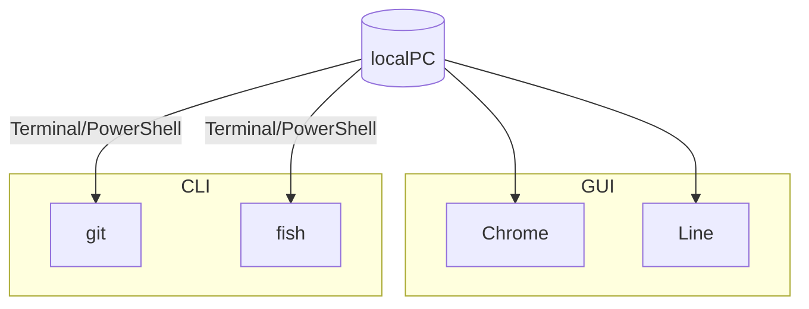
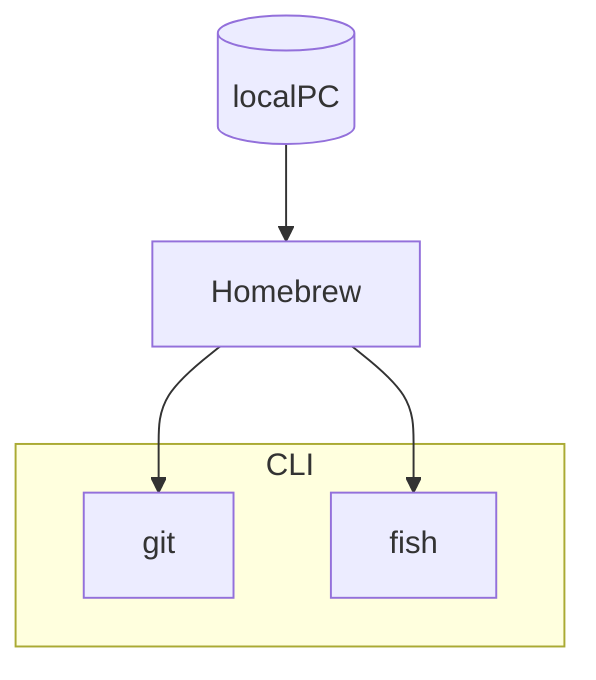

# はじめに

Obsidian の 1 番の問題は同期
私は Apple ユーザーなので iCloud で同期させていたが、iCloud だと同期が間に合わずに conflict した際に merge する機能がなくてノートが増えてしまう
単一のノートがノート、ノート 2、ノート 3 みたいになる

Obsidian Sync に課金すれば簡単に全て解決するのだが、無料でも Self-hosted LiveSync というコミュニティプラグインで解決できるみたいなので導入してみた


サーバー上にデータベースを管理するアプリ (coachDB) をデプロイ (構築) して、そこを介して同期させるような仕組みの様子

ただし、**サーバー上にアプリを作るのは自力でやらないといけない**のでここが Self-hosted ということだろう
ハードルは高いが開発者様が手順を announce してるのでその通りにやれば良い
ググったら色々記事が出てきたが結局これを読むだけで何とかなった

> [!cite] 
>[Fly.io for self hosting CouchDB · vrtmrz/obsidian-livesync · Discussion #85 · GitHub](https://github.com/vrtmrz/obsidian-livesync/discussions/85)

手順は既に説明されているがかなり前提知識を要するので、このページでは**素人でも何となく何をしてるかがわかるように**解説をしてみる

# 設定の大まかな流れ

1. flyctl をインストール
2. flyctl でアプリの初期設定をしてデプロイ (構築)
3. Obsidian に Self-hosted LiveSync をインストール
4. Obsidian 側の初期設定

fly.io というサービスを用いてサーバー上にアプリをデプロイ (構築) する
データの通信量による従量課金制だが、**Vault の同期程度の通信で無料分を超えることはまずない**とのこと
**クレジットカードの登録が必須**だが、これはスパム対策と書いてある
自動で Hobby Plan に登録され 5＄/month と表示されるので一見有料に見えるが、最初に作成される「Personal」という Organization 内でアプリを使用する場合は 5$ 分までの使用は無料

# 1. Install the CLI

```
curl -L https://fly.io/install.sh | sh
```

まずここにだいぶ前提知識が必要
CLI は Command Line Interface の略
CUI(Character User Interface) ともいう
対義語は GUI(Graphical User Interface)

Chrome とか Line とか、開いたら操作するための画面が出てきますよね
こういうのは GUI

反対に Mac ならターミナル、Windows なら PowerShell でコマンドを打ちこんで操作するアプリ (パッケージと呼ぶ) は CLI
インストールもターミナルや PowerShell で行う
例として git や fish を挙げている



ここは fly.io のパッケージである flyctl をインストールして、そのパッケージのコマンドを使ってねってこと

> [!cite] fly.io の公式サイト
> 
>  [Install flyctl · Fly Docs](https://fly.io/docs/hands-on/install-flyctl/)

Windows の場合とか Homebrew 使用の場合はちょっと異なるので
公式サイトに則ってもう少し解説する

## Mac の場合

Homebrew を使用している場合はこのコマンド

```
brew install flyctl
```

Homebrew はパッケージ管理ソフト
CLI のパッケージってどこに何が入っているのかが凄くわかりにくいので、CLI を日常的に使用する場合は Mac なら Homebrew、Windows なら scoop などのパッケージ管理ソフトを使用すると便利
Homebrew なら brew コマンドで何がインストールされているか、バージョンがどうかなどを一元管理できる
ちなみに GUI のアプリを Homebrew で管理することも可能だったりする



Homebrew を使用していない場合はこのコマンド

```
curl -L https://fly.io/install.sh | sh
```

Linux でも同じコマンドで良いらしい

## Windows の場合

このコマンド

```
pwsh -Command "iwr https://fly.io/install.ps1 -useb | iex"
```

scoop のようなパッケージ管理ソフトは公式には対応してないっぽい

## flyctl がインストールされた

私は Homebrew を使用しているので brew コマンドでインストールした
これで flyctl コマンドが使用可能になった

# 2. Sign up (Credit card is required)

```
flyctl auth signup
```

flyctl コマンドで fly.io のアカウント作成ページを開く
ブラウザが自動で立ち上がるので適当にアカウントを作成する
クレジットカードも登録しておく

# 3. Create the working directory

```
mkdir flyio
cd flyio
mkdir couchdb
cd couchdb
```

ディレクトリを作る
ディレクトリ≒フォルダくらいの認識で良いと思う
ターミナルのディレクトリの初期位置はユーザー名のフォルダ

1 行目: mkdir で flyio フォルダを作成するとユーザー名のフォルダの直下にフォルダができる
2 行目: **cd はディレクトリ移動コマンド**なので flyio フォルダに入る
3 行目: mkdir で couchdb というフォルダを作る
4 行目: cd コマンドで couchdb フォルダに入る

こんな感じにフォルダが作成される↓


# 4. Create an app by CouchDB's image

```
flyctl launch --image couchdb
```

flyctl コマンドで couchdb というタイプのアプリを作るコマンド

> [!warning]
> 移行の flyctl コマンドは全て couchdb ディレクトリ (フォルダ) 内で実行すること
> ターミナル/PowerShell はフォルダ内を移動できる
> 前の手順で cd コマンドで couchdb ディレクトリ (フォルダ) 内に既に入っているはず

要するに Docker で Container を作っている←これは分からなくても OK

アナウンスではターミナルで設定の問答が表示されるって書いてあったけど私がやった時は
**?** **Do you want to tweak these settings before proceeding?**
と表示されたので y を押して Enter
ブラウザが起動されて以下のような画面に↓


アプリの設定をいじれるが、どうせ後でいじるのでこのまま Confirm Settings で OK
ただし**App name だけは使われていない名前に変更する必要がある**
上手くいくと couchdb フォルダ内に**fly.toml という名前のファイルが生成される**
これはアプリの設定ファイルにあたる

# 5. Create data volume

続いてこのコマンド
flyctl コマンドは fly と打っても機能する

```
fly volumes create --region nrt couchdata --size 2
```

nrt は東京の意味なので海外に住んでる場合は近いサーバーに設定する必要がある
東京のサーバーに 2GB の領域を確保しますよという意味っぽい

# 6. Modify created fly.toml as like below. Please change COUCHDB_USER

```
# fly.toml app configuration file generated for xxxxxx-yyyyyyy-0000
#
# See https://fly.io/docs/reference/configuration/ for information about how to use this file.
#

app = "xxxxxx-yyyyyyy-0000"
primary_region = "nrt"

[http_service]
  internal_port = 5984
  force_https = true
  auto_stop_machines = true
  auto_start_machines = true
  min_machines_running = 0
  processes = ["app"]

[env]
  COUCHDB_USER = "your_username"

  ERL_FLAGS="-couch_ini /opt/couchdb/etc/default.ini /opt/couchdb/etc/default.d/ /opt/couchdb/etc/local.d /opt/couchdb/etc/local.ini /opt/couchdb/data/persistence.ini"

[mounts]
  source="couchdata"
  destination="/opt/couchdb/data"

[build]
  dockerfile = "./Dockerfile"
```

さっき生成されたアプリの設定ファイルである fly.toml をこんな感じに書き直す
app = "xxxxxx-yyyyyyy-0000" ここにアプリ名を入力
primary_region = "nrt" ここは地域を入力。日本ならこのまま。
COUCHDB_USER = "your_username" ここはアプリを使用する際のユーザー名を設定
その他はコピペでオッケー

# 7. Prepare the dockerfile like this.

```
FROM couchdb:latest
RUN sed -i '2itouch /opt/couchdb/data/persistence.ini && chmod +w /opt/couchdb/data/persistence.ini && fallocate -l 512M /swapfile && chmod 0600 /swapfile && mkswap /swapfile && echo 10 > /proc/sys/vm/swappiness && swapon /swapfile && echo 1 > /proc/sys/vm/overcommit_memory' /docker-entrypoint.sh
```

このような内容が記載された dockerfile を作る

Dockerfile は**拡張子のないテキストファイル**なので Mac ならテキストエディット、Windows ならメモ帳とかで適当にファイルを作成する

> [!caution]
> この時.text などの拡張子が表示されず、消し忘れていることがあるので注意

ここさっきの fly.toml をみると下記のような部分がある

```
[build]
  dockerfile = "./Dockerfile"
```

さっきの dockerfile をもとにアプリを構築するということかな
"./Dockerfile" のところ、これはカレントディレクトリの Dockerfile という名前のファイルを指しているので


この様にファイルを配置する

# 8. Set your password as you like.

```
flyctl secrets set COUCHDB_PASSWORD=your_password
```

アプリのパスワードを設定する

# 9. Deploy

```
flyctl deploy
```

アプリをデプロイ (構築) する
couchdb 内で実行すれば先程作成した Dockerfile や fly.toml を読み込んでくれる

# 10. Open in browser.

```
flyctl open
```

ブラウザでアプリのページを開く
自動的に下記のページが開く↓

```
https://アプリ名.fly.dev
```

何か表示されたら成功

# 11. Open /_utils, Set up CouchDB (Just hit  Configure a Single Node)

```
https://アプリ名.fly.dev/_utils
```

これを開くとアプリのログイン画面が開くので設定したアプリのユーザー名、パスワードを入力してログイン

私の画面はすでにデータベースが生成されているが、最初はなにも表示されていないはず↓


# 12. Set up Self-hosted LiveSync

ここから先は Obsidian 内で初期設定をしていく
コミュニティプラグインから Self-hosted Live Sync をインストールして、設定画面に
魔法使いの wizard タブからセットアップ

1. Discard the existing configuration and set up の Next を押すと既存の設定が削除されて一旦画面が閉じる
2. 再度設定を開き同じボタンを押すとセットアップが始まる
3. あとは流れで

プラグインなどの設定が入った隠しファイルも同期設定できるのだが (Vault 直下にある.obsidian ファイル)、私が iPhone と Mac で同期した際には消えたりして安定しなかったので一旦 off にした


以下の項目を入力することになる↓

|key|value|
|---|---|
|URI|[https://アプリ名.fly.dev/](https://アプリ名.fly.dev/.md) |
|Username|COUCHDB_USER|
|Password|COUCHDB_PASSWORD|
|Database name|任意のデータベース名 (小文字半角英数字) |

# 13. Hit the `Check database configuration` button and Every `Fix` button.

設定の URI やユーザー名、パスワード、データーベース名を入力されているところの下に check ボタンがあり、押すとよく分からないがデータベースの設定を色々チェックしてくれる
駄目な部分は横に fix と表示されるので全てクリックする


# 14. Hit the `Test database connection` button.  

さっきのチェックボタンの上に配置してあるテストボタンを押す
 `Connected to ...` を表示されたら成功

# 15. If you are worried about how it will cost too. be sure to stop the app. (We can run it again with count 1.)

思ったより使ってしまってお金かかってきた場合は fly コマンドでオフにできる

```
fly scale count 0
```

これを 1 にすると再開できる
これは couchdb のディレクトリ内で実行すればいいのかな
今のところ使用予定はないので不明

# 端末を追加する

これは簡単

1. さっきの魔法使いの wizard タブに `copy setup URI` というボタンがあるので押すと URI が発行されてパスワードを設定できる
2. 別端末 (例えば iPhone) で空の vault を作成して、Self-hosted LiveSync をインストールし設定の `open setup URI`
3. 追加端末ですみたいな選択肢を選んで URI とパスワードを入力する

# おわりに

この記事の意味は日本語化とちょっとした用語解説くらいか
LiveSync にするとすごい勢いで同期される
スマホでメモを取るのが捗るようになった
