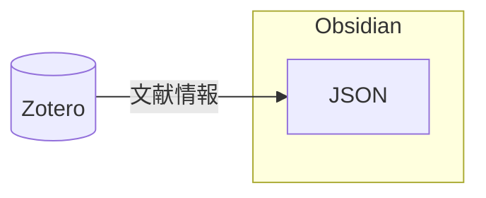
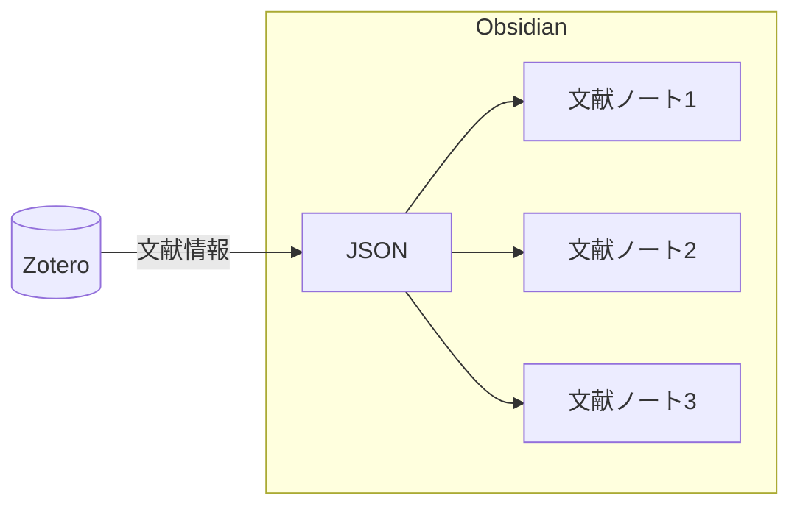
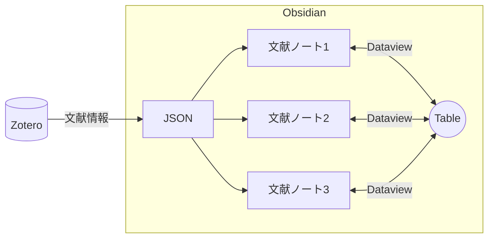
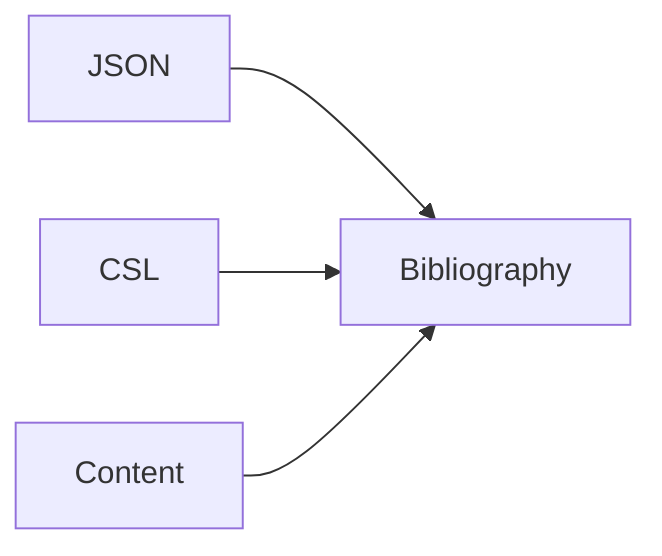

# はじめに

およそ 1 年前から文献管理ソフト Zotero と最強のメモツール Obsidian を用いた文献管理方法を行っている

> [!NOTE] seealso
> [[Zotero×Obsidian 文献管理のすゝめ|📘Zotero×Obsidian 文献管理のすゝめ]]

私以外にも同様の記事をアップする人もちらほらおり、現在引用されがちなのは

[An Updated Academic Workflow: Zotero & Obsidian | by Alexandra Phelan | Medium](https://medium.com/@alexandraphelan/an-updated-academic-workflow-zotero-obsidian-cffef080addd)

この記事である

私もこのワークフローに近い使い方をしているが、1 年も経過すると大分プラスαでできることが増えてきた
現在はプラグインの自作も一部行っている
そろそろ情報をアップデートする時期だろうと思い、今回まとめることにした

# Basic Usage 

これは、前回と大きく変わらない
文献を Obsidian にインポートして管理するための設定である

## Zotero に Better BibTex をインストール

[Better BibTeX for Zotero](https://retorque.re/zotero-better-bibtex/installation/) をまずはインストール
インストールしたらマイ・ライブラリを右クリック→エクスポート


Better CSL JSON 形式で OK
次に出力箇所を指定できるので、**Obsidian のフォルダを指定して**出力する

これで Zotero のマイ・ライブラリの文献データが Better CSL JSON という形式で出力される
**この出力は自動更新**なので Zotero に文献が追加されたり変更されるたびに自動で更新される



## 文献ノートの作成

これは Obsidian のコミュニティプラグインで行う
選択肢が複数あるが、よく見るのは Citations と Zotero Integration である

わたしは Citations プラグインを使用していたのだが、ノートを一個ずつ手動で作らないといけない点と過去に作成したノートを更新できない点がかなり不満であった

そこで、自作のプラグインを作成した

[GitHub - masaki39/simple-citations: Add & update simple literature notes.](https://github.com/masaki39/simple-citations)

簡易版だが、一括操作ができる Citations として作ってある
その他、私の知る選択肢を下記に示す

| コミュニティプラグイン        | 難易度 | カスタマイズ性 | 備考                 |
| ------------------ | --- | ------- | ------------------ |
| Simple Citations   | 極低  | 無       | 一括作成･更新            |
| Citations          | 低   | 低       | 2 年以上更新なし           |
| Zotero Integration | 中   | 中       | Annotations の取り込み可  |
| ZotLit             | 高   | 高       | 色々できるらしい<br>高機能が売り |

どの選択肢を使用するにしても、ノート名を

`[[@citation-key]]`

にすることを忘れてはいけない
これは、後に引用文献リストを作成する場合に必要になるからである



## Dataview で一覧表示

Dataview はクエリ言語でノートを拾ってテーブル表示することができるプラグインである
使用方法を覚えればかなり便利に使用できる

↓これが現在の私のテンプレート

```
table without id
authors[0] as FirstAuthor, journal, year, title, description, "[Note](" + file.name + ")" as Note, "[Zotero](" + zotero + ")" as Zotero, "[DOI](" + doi + ")" as DOI
from #タグ名  and "Literatures"
sort year desc
```

基本タグでノートを分類するようにしている

(上)Simple Citations で作成した文献ノート
(下)Dataview で収集された文献テーブル

この通り、文献ノート、Zotero の PDF、元文献へのリンクが表示されるようになる
ここまでが、Zotero×Obsidian の文献管理の Basic な使用方法である



# Organization 

Basic Usage ではとりあえず文献情報をまとめて表示することができるが、実際に重要なのはどれがどういう位置関係にあるのか、ということだ
相関関係を整理するにはグラフィックな手法を用いる必要がある
Obsidian で可能なグラフィックな手法は私の知る限り下記の 3 つである

| 機能          | 特徴                  |
| ----------- | ------------------- |
| Canvas      | コアプラグイン、シンプル        |
| Excalidraw  | Canvas よりリッチで自由表現が可能 |
| Excalibrain | 関係性のデータから自動で構築      |

Excalidraw は表現方法が多彩で図を書いたりもできる
Excalibrain はノートに children や parents などの決まった関係性を入力することで、自動で相関図を構築する機能を持っている

私は Obsidian の公式機能である Canvas で十分と考えて Canvas を使用している
例えば、下記のように表現できる


毎回行う必要はないが、思考の整理のために有用な手法であると考えている

# Writing 

実際に執筆を行う際に、最もメジャーな方法はワードで書く方法だ
しかし、長文を書いていると構成を考えたり推敲するのが難しい
そこでアウトラインを使用する書き方というものがある

- Introduction 
- Method 
- Results 
- Discussion 
	- summary of the results
		- たとえばここに結果を書きます。
		- 2 つ目の結果をここに書きます。
	- comparison with previous studies
	- Mechanisms of the Results
	- Limitations
- Conclusion 

まずはアウトラインから大筋を作って詰めていくという方法だ
Obsidian には Outliner というプラグインがあり、アウトラインの位置を入れ替えたり折りたたんだりして、アウトラインを便利に使用することができる様になっている

この書き方は長文の執筆の際に非常に便利な半面、最終的に文章につなぎ直すのが面倒であるという欠点が存在する
そこでアウトラインを文章として繋げるプラグインを自作した

[GitHub - masaki39/outline-converter: Convert outline to continuous text.](https://github.com/masaki39/outline-converter)

これでアウトラインで文章を最後まで執筆することが可能となった
その他 Better Word Count というプラグインも単語数や文字数を数えてくれるので愛用している

# Citations & Bibliography 

多くの人がワードで執筆活動を行う一番の理由は、引用文献の作成にあるだろう
Zotero や Mendeley などの文献管理ソフトには、引用文献作成のためのワードプラグインがついていることが多い
ただし、基本的には 1 つ 1 つ手動で引用を検索し挿入しなければならない

## Pandoc

Obsidian を上手く使用すると、ここの作業をかなり簡略化することができる
使用するのは [Pandoc](https://pandoc.org/installing.html) というソフトウェアだ
Obsidian で作成したマークダウンファイルを、引用と Bibliography 付きのワードファイルに変換できる
Pandoc で引用や Bibliography を生成するには 3 つの要素が必要である

- 文章本体: これは Obsidian のノートで OK
- CSL: Citations Style Language の略で、Journal ごとの引用形式を示すファイル
- JSON: 文献情報を記入したファイルで、文献ノートの作成用に作った JSON で OK



CSL は [Zotero Style Repository](https://www.zotero.org/styles) から検索して URL をコピーしてくる
変換したいノートのプロパティに

```
csl: URL
```

と記載するだけで、自動的に変換の際に CSL をダウンロードして適応してくれる

## Pandoc の書き方

引用の書き方は決まっており、引用したい部分に

```
[@citation-key]
```

と記載する
citation-key をもとに JSON ファイルから情報を引っ張ってくるようだ
複数の場合は

```
[@citation-key1;@citation-key2]
```

と記載する
これはつまり、結局は手動で 1 つずつ入力しないといけないということだ

ただここで気づくかもしれない

**文献ノートのファイル名を同じ形式で命名していた**

ということに

## Outline Converter を使う

Outline Converter は自作のプラグインなので、これを解決するコマンドも実装した
アウトラインに文献ノートへのリンクを貼っておくと自動でリンクを拾って Pandoc Style に変換し、直前の文のピリオドの前に移動するというコマンドだ

- Discussion 
	- Summary of Results 
		- ここに文章を書く
			- ここに `文献ノートへのリンク` を貼る
			- メモとかも書いても変換時には無視される

この用に文献ノートへのリンクをペタペタ貼っておくと変換コマンドで繋がった文章になると同時に、リンクが Pandoc Style に変換されるようなコマンドを作ってある

決まったルールで書く必要はあるが、これで全てがシームレスに繋がった

## 実際の設定

この Pandoc を実行するためには、前提条件として [Pandoc](https://pandoc.org/installing.html) が PC にインストールされていないといけない
実行するための Obsidian のプラグインには 2 つの選択肢がある

- Pandoc Plugin 
- Pandoc Reference List

前者はコマンドでワードファイルを出力することができ、後者は Obsidian 上で Bibliography をコピーできる形式で動的に生成する
私は現物主義なので、前者を使用している

Extra Pandoc auguments という設定項目があるので

```
--citeproc
--metadata bibliography=JSONファイルへのパス
-f markdown+hard_line_breaks
```

と記入する

1 行目は引用を作れよという指示で
2 行目は参照する JSON ファイルを指定
3 行目は通常は 2 回の改行で改行認定されるのを 1 回で改行とする設定

設定が完了した状態でワード変換コマンドを実行すると、指定の形式で引用と Bibliography が生成された**完成品がワードファイルで出力される**

# おわりに

以上が、現在私が実行できるワークフローの全容である
Basic Usage でも十分有用なので、是非とも試してほしい
