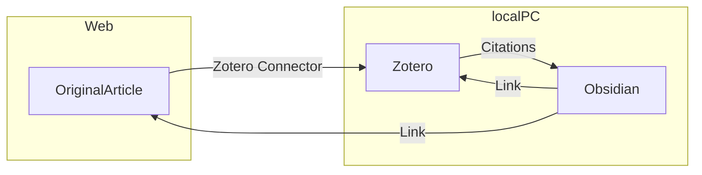

# はじめに

論文を読む際に文献管理をどうするか、どのツールを使用するか
これは多くの人が悩むことだと思われる

熟考の末に、安くかつ汎用性や拡張性に富む方法として、**Zotero×Obsidian**の組み合わせが優れているのではと考えて半年間使用した

十分に人に勧められるものであると判断し、まとめることにした

# 文献管理ツールとは

文献管理ツールはその名の通り文献のデータを整理するツール

- Mendeley
- EndNote
- Paperpile

などがメジャーだが、他にも数多く存在する
料金形態がそれぞれ異なる
この3つのうち、Mendeleyは基本無料だがEndNoteとPaperpileは有料である
Mendeleyを含む**無料のものは大抵クラウドストレージに制限**があり、データが増えてくると課金が必要になる

機能としては

1. PDFや文献のメタデータ(journal名など)をデータベースとして保存する
2. Webサイトから文献のデータをインポートする
3. Wordで引用文献リストを自動で作成する

この3つが最も重要であり、どのツールも使い勝手の差はあれど搭載している

# Why Zotero

Zoteroはオープンソースの文献管理ツールであり、**基本無料**である
上記の3機能は全て搭載しており、他のツールと比較して

- PDF viewerも兼ねており、それが優秀であること
- アドオンの拡張性が高いこと
- 別にクラウドストレージを持っていれば無料で使い放題なこと

が大きな利点である

特にアドオンの中でも
PDF viewerに翻訳機能を追加できる「Zotero PDF Translate」と
文献のメタデータを出力できる「Better BibTex for Zotero」
が強力なツールとなる

# Zoteroの基本機能

## 1. PDFや文献のメタデータ(journal名など)をデータベースとして保存する 

まずはこの機能は普通にアプリをダウンロードするだけで使用可能である
[Zotero | Your personal research assistant](https://www.zotero.org/)


UIは若干古い感じで、左側にフォルダを作成できる
右側には文献のメタデータが表示される
Zoteroの特徴として

**文献にPDF以外のファイルをなんでも追加できる**

というものがあり、文献に関連するスライドや画像などもとりあえず突っ込んでおくことが可能である


Viewerはこんな感じでシンプル
注釈やマーカーやメモなど、一通りのことはできる

## 2. Webサイトから文献データをインポートする

これはChromeの場合、「Zotero Connector」という拡張機能で可能となる
[Chrome ウェブストア - 拡張機能](https://chrome.google.com/webstore/detail/zotero-connector/ekhagklcjbdpajgpjgmbionohlpdbjgc?hl=ja)

文献のページでこの拡張機能のボタンを押すだけで自動的に文献のメタデータとPDFがZoteroに追加される

またPDFが既にある場合、**ZoteroにPDFをドラッグして入れるだけ**でも自動的にメタデータを収集して文献として追加することができる

## 3. Wordで引用文献リストを自動で作成する

これは「Zotero Word Processor Plugins」で可能になる
このプラグインは**Zoteroの初回インストール時に自動的にWordにインストール**される


WordにZoteroタブが追加される
詳細な使い方は省略するが、

- 指定の形式(Journalに応じて予め指定)で文献を挿入する
- 文献の番号を登場順に自動的に並べ替える
- 指定の形式で引用文献リストを自動的に作成する

などの機能がある
私はMendeleyからの移行だが、正直Mendeleyの方がUIの使いやすさは上だった
ただ、不便するほどでもなく実用範囲内だと思われる

# Zotero PDF Translate

PDF viewerはそのままでも実用に足るのだが、アドオンで翻訳機能をつけると使い勝手がかなり良くなる

[GitHub - windingwind/zotero-pdf-translate: Translate PDF, EPub, webpage, metadata, annotations, notes to the target language. Support 20+ translate services.](https://github.com/windingwind/zotero-pdf-translate)

GitHubのREADMEを見ながらなら簡単にインストールできる


選択範囲内を自動的にポップアップで翻訳してくれる
そのままコピーしたり注釈にしたりすることができる
長い文章も一気に翻訳可能である


設定画面
翻訳はGoogle翻訳がデフォルトだが、DeepLのAPIを取得すればDeepLも使用可能である
便利すぎて無料分が一瞬で溶けるので注意が必要

# Zoteroをクラウドストレージで同期

Zoteroはローカルでの使用のみなら完全無料だが、クラウドで他のデバイスと同期するとなると300MBしか無料分がなく、本格的に使用すると課金必須である
ただし、他のクラウドと組み合わせることで使い放題となる

(他にもあるかもしれないが)選択肢は主に2つ

1. WebDAVの機能をもつクラウドストレージを別に用意する
2. アドオンの「ZotFile」を使用してPDFだけ別のクラウドストレージに移動させる

調べるとそれぞれ別途解説記事が見つかる

1については
[Zotero & WebDAV（クラウドストレージ）で同期できる無料の文書管理・論文管理の環境を作る - Qiita](https://qiita.com/aizakku_nidaa/items/d4ee463e309dad5759a7)

ZoteroはWebDAVという機能をサポートしており、この機能がついているクラウドストレージは公式のものと同様に使用可能である
文献管理程度であれば無料分の容量でも十分足りると思われる

2については
[論文を読むフローを整理した｜Zotero + ZotFile + Dropbox | 飽き性の頭の中](https://blog.tawa.me/entry/zotero-dropbox)
ZotFileというアドオンはZoteroからPDFだけを抽出して指定の場所(クラウドでも可)にきれいにフォルダ分けして保存することができるアドオンである
PDF抜きなら無料の300MBでも十分足りるでしょという発想

**おすすめは1でWebDAVを使用する方法**
2の方法はZotFileがインストールされたデバイスでしかPDFにアクセスできなくなる
iOSはZotFileがサポートされていないのでPCでしか使用できなくなる

ちなみにZotFileにはPDFをきれいにRenameする機能もついているので、私はその目的だけでインストールしている

# pCloud

WebDAV対応のクラウドストレージは複数あるが、個人的なおすすめはpCloudである

pCloudはスイスのクラウドストレージのサービスで
**生涯買い切りプラン**を売りにしている

機能的にも十分で3年ほどの使用で元が取れるのでクラウドストレージに困っている場合は購入をおすすめする

インフレに伴い徐々に値上げしており今後も徐々に値上げが予想される
私が購入した2020年ブラックフライデーは2TB245ドルだった
**ブラックフライデーなど年に数回大幅に値下げする**ので値下げ時に購入するとよい

> [!NOTE]　WebDAV利用方法
> 
> 下記を連携アプリに入力する
> 
> 1. URL(どちらかから選択)
> 	- USサーバー: https://webdav.pcloud.com  
> 	- EUサーバー: https://ewebdav.pcloud.com
>
> 2. ユーザー名: アカウントのメールアドレス
> 3. パスワード: アカウントのパスワード

> [!caution]
> google連携でアカウントを作るとpCloud用のパスワードが設定されないので「パスワードを忘れた方へ」から再設定する必要がある

# 文献管理の方法論

ここまではZoteroの使用方法を解説した
Zoteroだけでも十分に使用に耐えるので、ここまでで留めておいても良い
ここからは文献データの管理方法について解説する

文献データ(というかデータ全般)の管理方法には複数の方法がある

- 単純にフォルダ分けをする
- タグを付ける
- データベースとして管理する

単純なフォルダ分けとタグ付けはZoteroや他のツールでも使用可能である
Evernoteを使用したことはあるだろうか
この方法は、一定数以上のデータが集まってくると限界がやってくる
タグ付けは面倒くさいし、フォルダはどこが最適か分からなくなる
私もかつてはEvernoteユーザーだったがノートが1000くらいになってから徐々に使わなくなった

データベースとして管理する
これはEvernoteの後に流行ったメモアプリのNotionが得意とする方法で、データにタグやプロパティ(メタデータ)を設定してそれを元に絞り込んだり並べ替えたテーブルを作って表示する
この方法はフォルダ分けよりも合理的に必要なデータを抽出できるが、プロパティ(メタデータ)の入力が面倒くさい
しかし、**文献データにはJournalや出版年数、authorなどのメタデータが既に含まれている**ため、文献管理とは噛み合った方法と思われる

そのため、Zoteroから文献データを出力して、そのメタデータを元にデータベース管理するのが良いのではと考えた

ツールとしてはNotionもありだが、より次世代のメモアプリであるObsidianを採用した
Notionとは一長一短な部分もあるが

- より軽量である
- より拡張性が高い
- MOCという概念での管理も兼ねることができる

この点からObsidianを採用した

Notionを使用する場合は「Notero」というアドオンを使用するらしい
[Zotero を使おう│Lui Yoshida Lab](https://edulab.t.u-tokyo.ac.jp/zotero/)

# Obsidianについて知っておくべきこと

Obsidianはメモアプリだが基本的にフォルダは使用しない
ページ間リンクを簡単に設定できるので、自分だけのwikipediaみたいな使用方法ができる


MOCという概念はmap of contentsの略で、ノートのリンク集のようなノートを複数作成してコンテンツを管理する方法である

今までのフォルダ分けと異なり、回帰構造や重複支配もなんでも許容する自由なデザインが可能になっている
一応、今までのメモアプリのようなフォルダ分けやタグ付けも可能となっている

また、Notionのプロパティもしくはメタデータに相当する情報を、フロントマターと呼ばれるノートの冒頭の領域にYAML形式で管理している

```
---
title:
---
```

ノートの頭に---で囲った領域を作成して、好きな名称のkeyを設定してメタデータとする

今回は、文献ごとにノートとして取り込んでメタデータをフロントマターで管理していくようにする
この方法のメリットは任意のkeyを好きなだけ追加できることである

もし、study designについての情報を追加したい場合は

```
---
title:
design: RCT
---
```

手動にはなるが、必要な情報があればこのようにどんどん追加することができる

ver.1.4からUIがクリックして選択していくプロパティ表示に変化したが、~~従来通りのYAML形式の方が編集が楽なので設定で戻すと良い~~
2024-02-05追記: 
意外とプロパティ表示も悪くないので、ホットキーに`⌘+Shift+S`でソースモードに切り替えるホットキーを設定して適宜切り替えれるようにした

> [!NOTE] 従来の表示方法への戻し方
> 
> 設定→エディタ→Properties in document→Source

# Better BibTeXでZoteroからメタデータを自動出力する

ここではZoteroのアドオンの「Better Bibtex for Zotero」を使用する
まずはインストール
[Better BibTeX for Zotero](https://retorque.re/zotero-better-bibtex/installation/)

インストールしたら
マイ・ライブラリを右クリック→エクスポート


Better CSL JSON形式でOK
次に出力箇所を指定できるので、**Obsidianのフォルダを指定して**出力する

これでZoteroのマイ・ライブラリの文献データがメタデータも含めてBetter CSL JSONという形式で出力される
**この出力は自動更新**なのでZoteroに文献が追加されたり変更されるたびに自動で更新される

# CitationsでObsidianにメタデータをインポートする


Obsidianの「citations」というコミュニティ・プラグインを使用する


インストールしたら設定から参照するデータベース(先程自動出力設定したマイ・ライブラリ.json)を指定する

```
---
tags:
title: "{{title}}"
authors: [ {{authorString}} ]
journal: "{{containerTitle}}"
year: {{year}}
doi: "[Go To Article](https://doi.org/{{DOI}})"
zotero: "[Go To Zotero]({{zoteroSelectURI}})"
---
[Go To Article](https://doi.org/{{DOI}})
[Go To Zotero]({{zoteroSelectURI}})

```

これは私が使用しているテンプレート
設定のテンプレートにインポートしたいメタデータをYAML形式で記載しておくことができる
このようにtitleやdoiリンク、zoteroへのリンクなどを設定可能である

ここまで設定したら、ショートカットを使用して**ワンタッチで文献データをノートとしてインポートできる**様になる
このノートにはテンプレートに設定したメタデータがYAML形式で含まれる様になる

インポートしたノートはどのように管理しても良い
とりあえず1つのMOCにまとめてもいいし、好きに分類しても良い
文献ノートにメモを記しても良い
Obsidianの売りは自由度の高さにある

> [!info] ~~2023-12-06追記~~
> ~~Citationsプラグインでauthorsが分割されない問題をTemplaterで解決してみた記事~~
> ~~First authorを抽出したいなら~~
> [Templaterでフロントマターを書き換える](Templaterでフロントマターを書き換える.md)
>
> > [!info] 2024-02-05追記
> > authorsの前後に[]を書くだけで配列として認識されることに気がついた

# インポートしたノートをデータベース管理する

次にインポートしたデータをデータベースとして管理する
メタデータを元に自動的にtableを作ることができる素晴らしいコミュニティプラグイン「dataview」を使用する

使用方法は別記事に記載

> [!seealso] Seealso
> [[Dataviewの使い方]]

dataviewを使用して、抽出したいtableを設定したら完成

# 完成した全体像



simpleに書くとこのような構造になる
記事をZotero→Obsidianと順に取り込んで、Obsidianで管理する

他のデバイスでも使用する場合は
Zoteroの同期にWebDAVを使用する
~~Obsidianの同期方法は多岐にわたるので本記事では解説しないが、Apple userならばiCloudが最も楽なので私はiCloudを使用している~~

[Obsidianの複数端末同期方法まとめ (Mac/Windows/iOS/Android)](https://pouhon.net/obsidian-sync/6796/)

> [!info] 2024-02-05追記
> より良い同期を求めてSelf-hosted LiveSyncに移行した
> 設定難易度はかなり高いが、やる価値あり
> [[Self-hosted LiveSyncの初期設定]]

# 最後に

かなり複雑に思えるかもしれないが自動化出来ている工程が多いので、最終的な完成形では

Zoteroにインポート→Obsidianでショートカットでノート作成

これだけでデータベースが完成し、予めdataviewで設定したtableに反映されるようになる
個人的には現時点での無料最強構築ではないかと思っている
時間があればこの環境構築を一回行ってみてほしい
