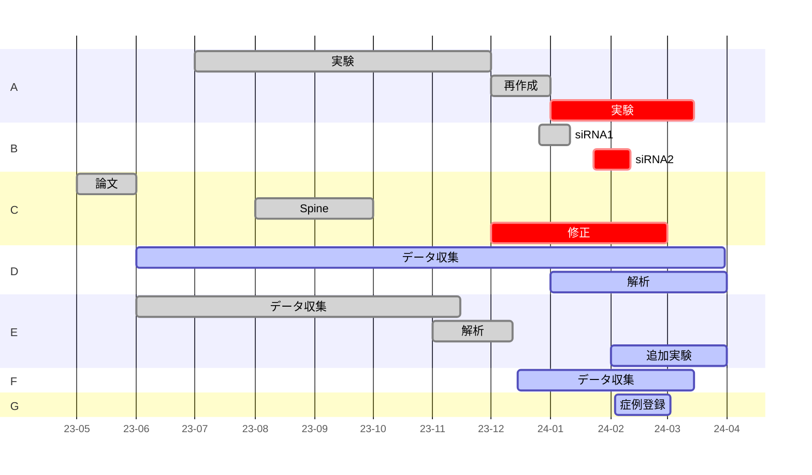

# はじめに

Obsidian のデイリーノートってどう使うのが正解なのか
検索すると色んな使い方があるよう
徐々に改変しながら使っているが、現在の型がしばらく安定しているので一旦記録

# 使用しているコミュニティプラグイン

- Dataview
- Templater
- Calendar

最初期からずっとこの 3 つで運用している
基本的には Daily note で日々の記録→Weekly note で自動集計っていう流れ

# Daily note の構成

## テンプレート

```
---
sleep: false
medication: false
stretch: false
---
< [[<% tp.date.now("YYYY-MM-DD", -1, tp.file.title, "YYYY-MM-DD") %>]] | [[<% tp.date.now("YYYY-MM-DD", 1, tp.file.title, "YYYY-MM-DD") %>]] > WN: [[<% tp.date.now("YYYY-[W]ww", 0, tp.file.title, "YYYY-MM-DD") %>]]
# Tasks
> [!check]-
> ```dataview
> TASK
> from "デイリーノートのフォルダ"
> WHERE !completed
> ```
## Today
- 
## Additional Tasks

# Free Space
```

こんな感じ

## フロントマター

![[Pasted image 20240217234140.png|500]]

ここは習慣化のコーナー
こんな感じでチェックボックスを作ってある
数字や文字列も集計できるが、チェックだけが楽なのでチェックボックスにしている
自動的に Weekly note で集計される

## 日付リンクのコーナー

![[Pasted image 20240217234329.png|500]]

これは前後の日付と Weekly note へのリンクを Templater で自動挿入する
この時にファイル名を参照するようにすると Calendar との合せ技で未来や過去のデイリーノートも問題なく作れる

## タスクコーナー

![[Pasted image 20240217234602.png]]

Dataview でデイリーノート内の未完了のタスクをリストアップする
コールアウトでデフォルトでは閉じてある

![[Pasted image 20240217234812.png]]

開くとチェックボックスが出現
Today コーナーにここからピックアップ
Additional Tasks コーナーに追加タスクを書き込む

## メモコーナー

最後のコーナーは自由なコーナー
とりあえずここにメモを取り始める事が多い

# Weekly note の構成

基本的にはタスクの全体像把握と集計の場所にしている
コードブロックばかりなのでテンプレートは割愛

## 締め切りコーナー

![[Pasted image 20240217235332.png]]
重要な締め切りのカウントダウン
締め切り毎にノートを作成して簡単な要件を記録して dataview で一覧表示にする
ノートに deadline というプロパティを作成して締め切りを表示するようにしている

## ガンツチャートコーナー



ここは複数のタスクを mermaid 記法のガンツチャートで把握するコーナー
mermaid 記法、慣れたら凄く楽
タスクの全体像把握用なので、たまに更新する程度

## タスクコーナー

![[Pasted image 20240218000211.png|500]]

dataview でタスク完了日を自動集計する

## 習慣化コーナー

![[Pasted image 20240218000416.png]]

Daily note のチェックボックスを集計
マークを気分で変えたりしている
stretch(軽い運動をする) が真っ赤ですね...

## フリースペースを振り返るコーナー

```
![[{{sunday:gggg-MM-DD}}#Free Space]]
![[{{monday:gggg-MM-DD}}#Free Space]]
![[{{tuesday:gggg-MM-DD}}#Free Space]]
![[{{wednesday:gggg-MM-DD}}#Free Space]]
![[{{thursday:gggg-MM-DD}}#Free Space]]
![[{{friday:gggg-MM-DD}}#Free Space]]
![[{{saturday:gggg-MM-DD}}#Free Space]]
```

フリースペースの記載がズラッと並ぶ

**以上！！**

# おわりに

Daily note の情報はその時点で日付情報を含むので、集計できる dataview とは非常に相性がいいと思う
運用はかなりシンプルなので結構使いやすい
どこかの誰かの参考になれば
