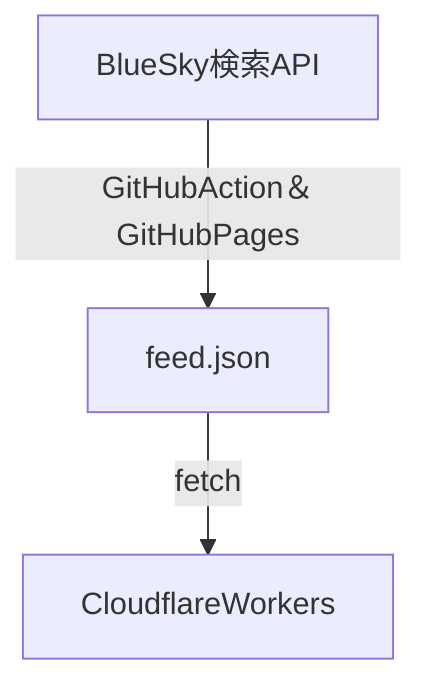

# はじめに

私はBlueSkyというSNSをやっている。BlueSkyはXの互換SNSのような認識で捉えられることが多いが、思想的には大きく異なっている。それを代表する機能が｢フィード｣である。フィードは任意のアルゴリズムでタイムラインを構築する機能であり、共有することもできる。BlueSky上には多種多様のフィードが公開されており、それを自分のホーム画面にピン留めしていくことで、自分だけのタイムラインを育てていくことができる。フィードの作成は完全にコミュニティに委ねられてるので、アルゴリズムが経済的･政治的な影響を殆ど受けないという点でXや他のSNSとは一線を画している。一方で、ある程度カスタマイズしないと誰もいない虚空のタイムラインに放流されてしまう。

# 自分でもフィードは作れる？

フィードは多数公開されているものを使えばいいのだが、自作することもできる。公式もフィード作成のスターターキットを用意している。

> [!quote] [GitHub - bluesky-social/feed-generator: ATProto Feed Generator Starter Kit](https://github.com/bluesky-social/feed-generator)

自分でサーバーを立てれば...しかし、一般人にサーバーの維持管理はかなりハードルが高い。

# フィードジェネレーターの問題

コミュニティの中には、フィードを簡単に作れるサービスを展開している人もいる。最も代表的なのはSkyfeedだ。Skyfeedの作者redsolver氏はBlueSkyの全ポストをデータベース化し、そこから絞り込んでフィードにするようなシステムを構築している。聞いただけで気の遠くなるようなデータベースに思える。これをなんと無料で提供している。実際、BlueSkyの人口増加に伴ってサーバーダウンを頻発し、当初は7日前まで遡れたポストが現在では1日2日しか遡れないようになった。

私は、Skyfeedから避難するようにBlueSky Feed Creator(BSFC)を使用し始めた。このサービスはニュージーランドの方が作っているようだった。リアルタイムに条件に合致するポストを取得しフィードに登録していくような仕組みになっていた。過去のポストには遡れないが、設定以後のポストは極めてリアルタイムに拾っており、優秀なフィードジェネレーターだった。当初は3フィードまで無料で作成可能であったが、こちらも人口増加に合わせて無料版を格下げした。具体的には、無料版フィードでは条件にあうものをランダムピックアップするようになった(漏れが発生するようになった)。運営としては破綻しないためにはそうするしかないだろう。Skyfeedよりも健全な判断に思える。

その他にもフィードジェネレーターは何種類かあるが、そもそもサーバーを維持管理しないといけない以上、規模が増大したら無料を維持できないのは明白である。

# フィードを無料でセルフホストしたい

そうなると安定を取るにはセルフホストするしかない。私が欲しいのはキーワードをピックアップするような単純なフィードなので、なんとか無料でできないか。できないならBSFCに課金しよう、と思った。

> [!quote] [最小限のBlueskyのカスタムフィードを作る - Qiita](https://qiita.com/rutan/items/a26652113935606c7855)

検索すると上記の記事を見つけた。フィードは

- `getFeedSkeleton` のエンドポイントでポストのjsonが呼び出せる
- `.well-known/did.json`のエンドポイントでフィードのDID(Decentralized Identifier)が呼び出せる

この2点だけあれば動くらしい。これは、なんとかなるかもしれないぞ。

# 考えた仕組み

## パーツ１：フィード本体

まず、フィード本体はCloudflare Workersを使うといいだろう。Cloudflare Workersはサーバーレスでコードをデプロイできるサービスで、1日10万リクエストまで無料(リクエストあたりのCPU処理時間10msまで)である。上記2つのエンドポイントだけを搭載させれば軽量であるし十分いけるはずだ。

## パーツ2：ポストをどう取得するか

Workersを使った既存のものがないかChatGPTに聞くと

> [!quote] [GitHub - jcsalterego/Contrails: Contrails is an ATProto Feed Generator backed by Cloudflare Workers and Bluesky Search.](https://github.com/jcsalterego/Contrails)

が出てきた。既にアーカイブされている。このContrailsはWorkersに仕事をさせすぎで複雑に見える。軽量シンプルフィードを目指そうと考えた。postのjsonをどこかからfetchするだけの仕組みにすれば軽量のフィードができるだろう。

キーワード型フィードなのでpostのjsonを取得するのはBlueSkyの検索APIを使用する。検索APIはBlueSkyの検索結果と同じポスト一覧を返す。これをfetchできるように静的にホスティングする。これはGitHub Pagesで問題ない。

## パーツ3：自動化

定期的に検索してjsonを更新するのはGitHub Actionのcronでいけそう。さらにCloudflare Workersはwranglerで操作できるのでCloudflare Workersで動かすコードのデプロイはActionで自動化できそう。何なら削除も自動化できそう。さらに1リポジトリ1フィードにすればデプロイ時の命名やdid解決もリポジトリ名から自動生成できるはずだ。

必要な環境変数が幾つかあるが、調べたらGitHubにはAction必要な環境変数を登録する機能(SecretsとVariables)の機能があるっぽい(初めて知った)。

## 仕組みまとめ

難しそうに書いたが、定期的に自動で検索してfeed.jsonを作成して、そこを参照するコードをCloudflareWorkersにデプロイする。これだけのシンプルなしくみだ。ここまで構想を詰めてからCodexで作ってもらったら、ほぼほぼ完成品ができたので多少手直しして終了。

# 完成品

下記のリポジトリに作成した。

> [!quote] [GitHub - masaki39/selfhost-bsky-feed: Self-host a simple keyword-based Bluesky feed with GitHub Actions.](https://github.com/masaki39/selfhost-bsky-feed)

3つの自動化アクションがある。

READMEに従って検索ワードや必要な設定値を登録して、Create Bluesky FeedのGitHub Actionでボタンを押せばフィードができる。非常に簡便である。問題点はcronの遅延とBlueSkyの検索APIの遅延の可能性で、リアルタイム性は必ずしも高くない。

# おわりに

滅茶苦茶単純な仕組み思いついたわ！と思ったがREADMEを書いてみたら結構複雑に見えた。このサイトを作っているQuartzを使う時に履修する仕組み達の組み合わせなので実現できたんだと思った。とはいえ、安定したキーワード系フィードを量産できるようになったのは大きいし、活用していこう。
