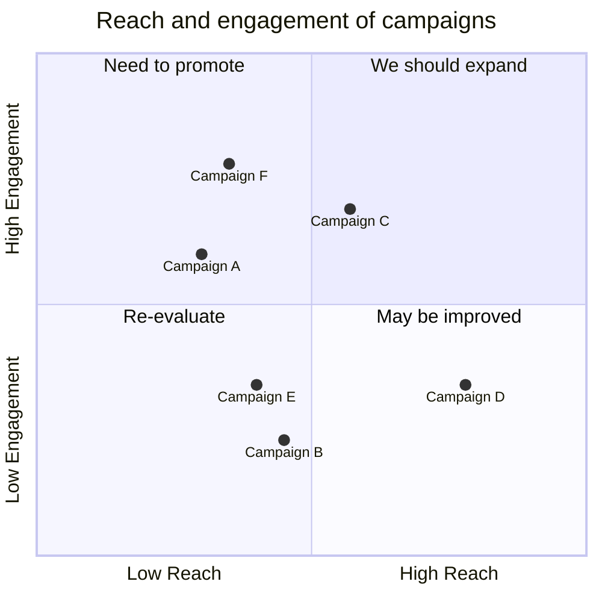
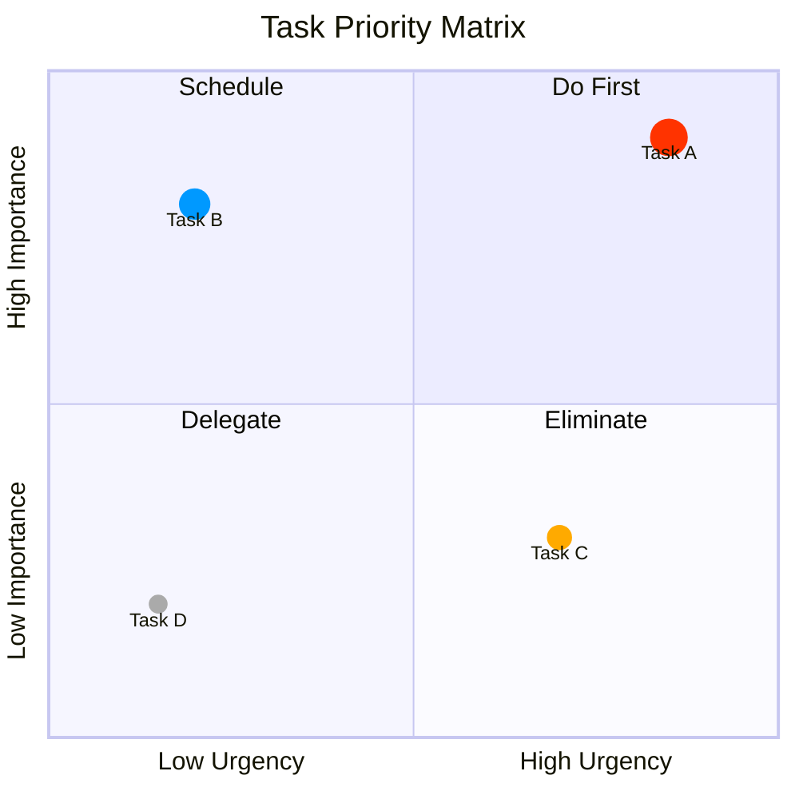

# はじめに

Visualizationの目的は「何かと何かを比較すること」だ。手法はある程度定型化されており、その1つが「2軸で物事を分類する」こと。いわゆる2×2のマトリクスで、コンサルやプレゼンでよく使われる表現方法である。最近読んだ本に書いてあり、一部取り入れていくことにする。

> [!quote] [イシューからはじめよ――知的生産の「シンプルな本質」](https://www.amazon.co.jp/%E3%82%A4%E3%82%B7%E3%83%A5%E3%83%BC%E3%81%8B%E3%82%89%E3%81%AF%E3%81%98%E3%82%81%E3%82%88%E2%80%95%E7%9F%A5%E7%9A%84%E7%94%9F%E7%94%A3%E3%81%AE%E3%80%8C%E3%82%B7%E3%83%B3%E3%83%97%E3%83%AB%E3%81%AA%E6%9C%AC%E8%B3%AA%E3%80%8D-%E5%AE%89%E5%AE%85%E5%92%8C%E4%BA%BA/dp/4862760856)

当然、ExcalidrawやFigmaなどの視覚化ツールを使えば容易だが、**Mermaid記法を使えばプレインテキストだけで完結する**。ObsidianはMermaidをネイティブサポートしているので、ノート内にそのままレンダリングされる。

> [!quote] [Quadrant Chart \| Mermaid](https://mermaid.js.org/syntax/quadrantChart.html)

# Quadrant Chartとは

Quadrant Chartは、X軸・Y軸の2軸でスペースを4つの領域に分割し、各要素をプロットしていくグラフである。

用途の例：

- タスクの「緊急度 × 重要度」分類（アイゼンハワーマトリクス）
- プロジェクトの「コスト × 効果」評価

# 書き方

## 基本構造

```
quadrantChart
    title タイトル
    x-axis 左ラベル --> 右ラベル
    y-axis 下ラベル --> 上ラベル
    quadrant-1 右上
    quadrant-2 左上
    quadrant-3 左下
    quadrant-4 右下
    要素名: [x, y]
```

- 座標は `[x, y]` の形式で **0〜1の値**を指定する
- 左下が `[0, 0]`、右上が `[1, 1]`

## 象限の番号

```
quadrant-2 (左上) | quadrant-1 (右上)
-----------------+-----------------
quadrant-3 (左下) | quadrant-4 (右下)
```

## 基本例



# スタイリング

シンプルな図で十分な場合が多いが、見た目を多少はいじることができる。

## 直接指定

プロット名の後ろにオプションを追記する。

```
Campaign A: [0.9, 0.0] radius: 12
Campaign B: [0.8, 0.1] color: #ff3300, radius: 10
Campaign C: [0.7, 0.2] radius: 25, color: #00ff33, stroke-color: #10f0f0
```

## classDef

複数の要素に同じスタイルを適用したいときは `classDef` を使う。

```
Campaign A:::class1: [0.9, 0.0]
classDef class1 color: #109060
```

## スタイルオプション一覧

| オプション | 説明 |
|-----------|------|
| `color` | プロットの塗り色（16進数） |
| `radius` | プロットの半径 |
| `stroke-color` | 枠線の色 |
| `stroke-width` | 枠線の太さ |

## スタイル例



# おわりに

座標指定に慣れが必要だが、マークダウンのみの環境でVisualizationができるのは大きい。また、基本構造をテンプレートに入れておけば、数字を入れるだけなのでそこまで難易度は高くない。

どうしてもテキストだけでは考えがまとまらない時に使えそうだ。その際に重要なのは可視化の手段ではなく軸選びにあるので、簡便なMermaid記法は悪くない選択肢だろう。
