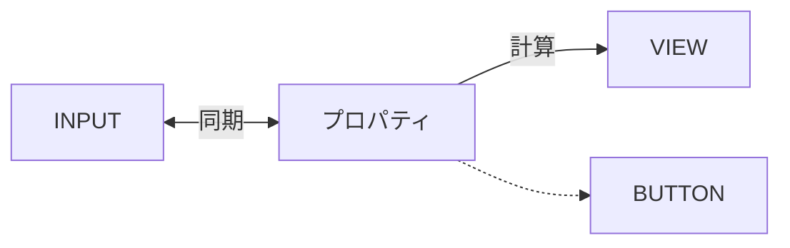
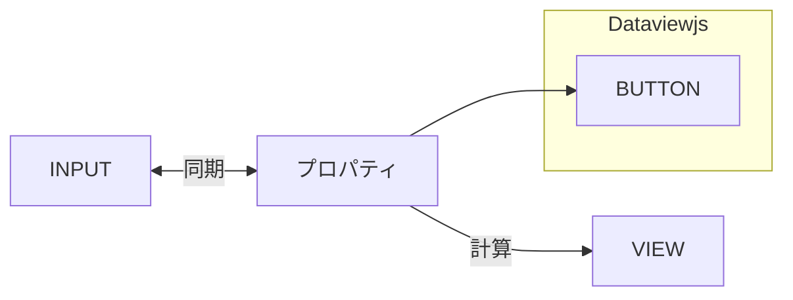
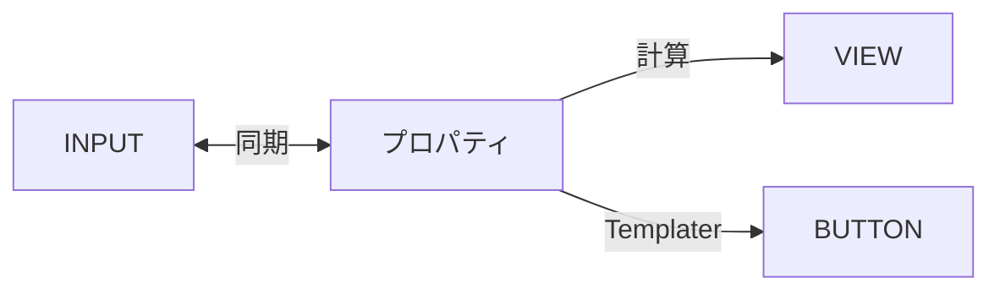

# はじめに

前回、[[📘Dashboard++で魅力的なホームページをつくろう！]] で使用した Meta Bind で作成した検索ボックスが便利だったので簡単に解説。

# Meta Bind の概要

Meta Bind は入力、出力、ボタンの 3 つの要素からなっている。入力と出力はプロパティと紐づけることができ、簡単な入力フォームや計算機を作ることができる。ゲームのステータス計算などに使用するのを念頭に作られている様子。ボタンは決まった動作を行う場合に有用である。使い方は一見難しそうに見えるが、プラグインに playground や help コマンド、更にはボタンメーカーがついているので、比較的簡単に使用できるようになっている。



個人的に残念だと思うのは、プロパティがボタンに紐づいていないという点。入力を参照したコマンド実行などができるといいのに。今回は Dataviewjs や Templater でそれを実現してみる。

# 検索ボックスを作ってみる

実際に作成したのがこちら。


search という名前のプロパティと紐づいた検索ボックスに語句を入力する。そこを参照した 3 種の検索コマンドボタンを作った。Dataviewjs で実現するパターンと、Templater を使うパターンを考えてみた。

# Dataviewjs を使う方法

これは前回の記事に書いたやり方で、Dataviewjs でボタンを随時更新していくやり方。Dataview で search プロパティの値を取得して、それをもとにボタンを Dataview で作る。インプットアクション Meta Bind のボタンアクションの１つで、コマンドが入力を要求する場合に指定の文字入力ができるアクションだ。

```js
const str = dv.current().file.frontmatter.search;

dv.paragraph('```meta-bind-button' + `
label: Search
icon: ""
hidden: true
class: ""
tooltip: ""
id: rsearch
style: default
actions:
  - type: command
    command: obsidian-another-quick-switcher:search-command_recent-search
  - type: input
    str: "${str}"
`+'```')
```

メリットは、1 つのファイルで完結すること。デメリットは、無理矢理感があること笑



ここで考えたのは、インプットアクションを Templater で再現すればいいのではということ。

# Templater で全て解決する場合

結局 Templater で解決できました。Templater のコマンドでプロパティを参照すればいい。

```js
label: Recent
icon: ""
hidden: true
class: ""
tooltip: ""
id: rsearch
style: default
actions:
  - type: command
    command: templater-obsidian:Templates/🍤Recent_file_search.md
  - type: updateMetadata
    bindTarget: search
    evaluate: true
    value: x
```

コマンドのところに書いてあるのは、Templater で作成したコマンド。内容は以下。

```js
app.commands.executeCommandById("obsidian-another-quick-switcher:search-command_recent-search");
const el = document.activeElement;
if (el && el instanceof HTMLInputElement) {
    el.value = tp.frontmatter.search.replace(/　/g, ' ');
    el.dispatchEvent(new Event('input', { bubbles: true }));
}
```

スマホとかだとディレイをいれる必要があるかも。メリットはやはり柔軟性が高いこと。Another Quick Switcher だと全角スペースで or 検索にならないので半角スペースに変換をついでにできる。デメリットは、 Templater と Meta Bind が同時に同じプロパティを参照しているからなのか、プロパティが少し前の値に戻ったりするバグが頻回に起きる点。ただ、updateMetadata というアクションを追加することでプロパティが変化しないように固定できるので問題ない。



Templater が結局万能という。

# Web 検索コマンド

これは好きな検索エンジンの検索ページを開くだけ。私の場合は Duckduckgo。

```js
const search = tp.frontmatter.search;
const encodedSearch = encodeURI(search);
open("https://duckduckgo.com/?q=" + encodedSearch)
```

Google でもできるはず。

# おわりに

検索フォームのメリットは異なる検索方法を連続して行うことができる点かな。あとは先述の全角スペースの変換。後は映え。せっかくホームページ作ったので。メモボックスも作ったけど、今回はここまで。
