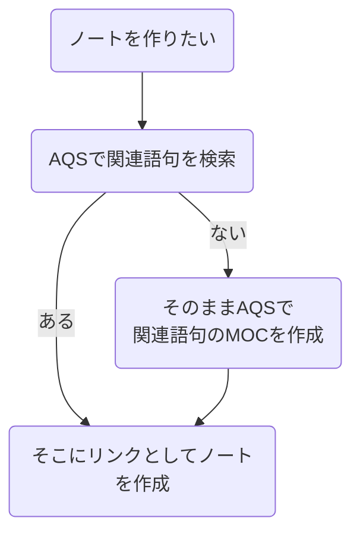
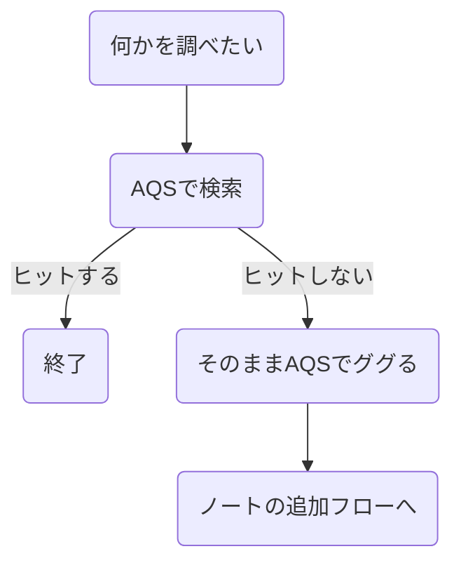
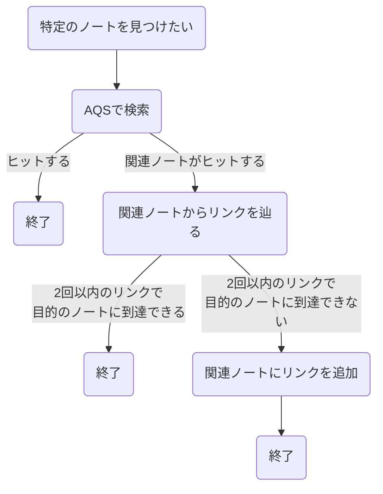
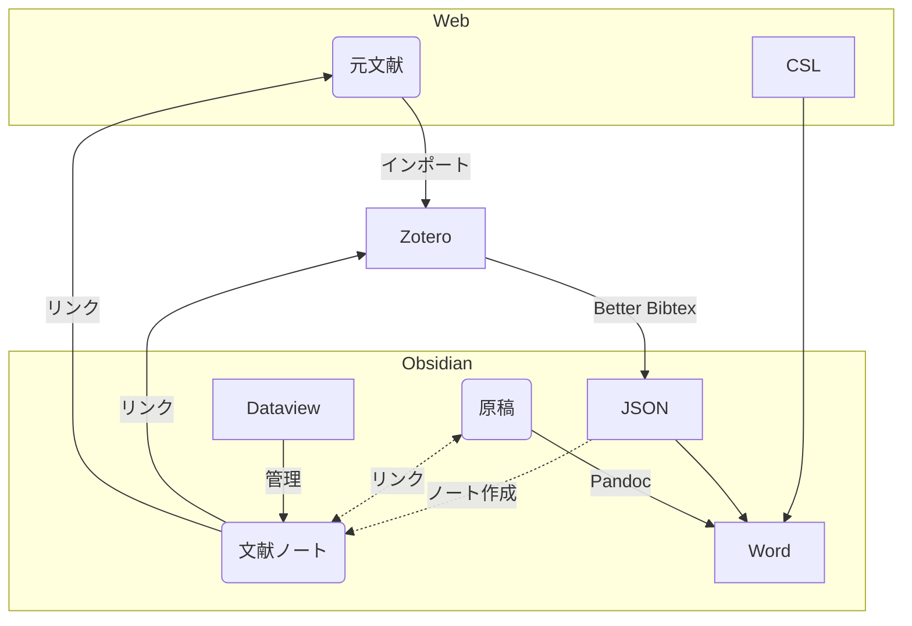

%%

# Outline 

- [x] はじめに
	- Obsidian を使用して約一年経過現在の運用まとめ。
	- 大体ノートは 1600 超くらい？
	- 全部新規作成したノート達である。
	- ちょっと羅列気味、備忘録的な感じかも。
- [x] 現在使用しているワークフロー
	- [x] MKMS
		- Minerva Knowledge Management System の略。考案者は tadashi-aikawa さん。
		- {{break}}
		- [📘丸3年Obsidianを利用して培ったノート戦略を体系化してみた - Minerva](https://minerva.mamansoft.net/%F0%9F%93%98Articles/%F0%9F%93%98%E4%B8%B83%E5%B9%B4Obsidian%E3%82%92%E5%88%A9%E7%94%A8%E3%81%97%E3%81%A6%E5%9F%B9%E3%81%A3%E3%81%9F%E3%83%8E%E3%83%BC%E3%83%88%E6%88%A6%E7%95%A5%E3%82%92%E4%BD%93%E7%B3%BB%E5%8C%96%E3%81%97%E3%81%A6%E3%81%BF%E3%81%9F)
		- {{break}}
		- このサイトを大いに参考にしている。
		- 基本的な考え方
			- ノートに素早くたどり着くことが一番の目的。まずは検索して少なくとも関連のあるノートに着陸して、リンクで目的のノートに到達する。リンクは関連性の強いノート同士には強いが、関連性の弱いノートまで辿り着くのは時間がかかる。ので、検索＋リンクをセットで使用する。
			- {{break}}
			- すぐにたどり着けなかった場合はリンクを追加していく。Web 検索するのと同じような動きなので分かりやすい。ノートの作成も同じ動きで良いのがポイントで、検索して見つからなければ新規作成して、リンクは関連ノートに付ける。フローチャートは今のところ以下の通り。
			- {{i:mermaid1}}
			- 厳格なノートの管理には多分向いていない。作ったノートはいつか｢じゃあ、またいつかどこかで｣みたいな感覚で作っている。その代わり、大量のノートがあっても決して破綻はしないだろうという安心感がある。
		- ノートの分類ルール
			- これは本家様を丸パクリ。僅かに改変。
			- {{i:table1}}
			- よくできていると思う。
		- MOC の作成ルール
			- 単語 (glossary note) と Hub note を主に MOC(Map of Contents: リンク集) として使用している。構成は以下の通り。
			- {{i:table2}}
			- 今のところ不満はなし。
		- Another Quick Switcher(AQS) と Various Complements(VC)
			- この 2 つのコミュニティプラグインは tadashi-aikawa さんが作っているもので MKMS と相性がいい。というかその様に作られているので必須アイテム。
	- [x] MARS 
		- Marvelous Academic Research System の略。考案者は私。Zotero と Obsidian で検索すると英語のサイトで見かける Academic Workflow を modify したもので、一応テンプレ Vault 配布もしている。
		- {{break}}
		- [Marvelous Academic Research System](https://masa21gifus.gumroad.com/l/ucwfc)
		- {{break}}
		- 一年かけてかなり洗練させたつもり。
		- [x] 仕組み
			- 何度か説明記事を書いたし、Vault 配布もしているのでざっくり。
			- {{i:mermaid2}}
			- 図で書くとかなり複雑に見える。PDF を文献管理ソフト Zotero にダウンロードして、Zotero のアドオンの Better BibTex で文献データを JSON ファイルで自動出力する。JSON をプラグインで読み取って文献ノートを作成する。作成したノートを Dataview で整理･管理する。さらに、JSON から文献情報を読み取り、Pandoc で引用文献リスト付きの文書を作成する。
		- [x] 既存のワークフローの問題点
			- よく英語で説明されているこのワークフローには大きく 2 つの問題がある。図の点線部分にあたる。
			- {{break}}
			- 1 つは、文献ノートの作成が 1 つずつ手作業で、情報の更新も手作業じゃないとできないこと。Obsidian 内に Zotero の文献ノートが全て生成されないと、結局 Zotero でも検索を要するので Dataview での管理のメリットが半減する。もう 1 つは、引用の追加方法で、Pandoc で引用情報を読み取るには Pandoc 形式で引用を挿入しなければならない。
			- {{i:code1}}
			- citation-key は JSON から文献情報を得るためにアクセスキーみたいなもので、Better BibTex が自動で作ってくれる。どのプラグインも Pandoc 形式での引用挿入コマンドがついているが、引用をいれるためには毎回この引用挿入コマンドで文献を検索しないといけない。
		- [x] Simple Citations 
			- この問題点を解決するために、簡単なプラグインを作成した。
			- {{break}}
			- 
			- {{break}}
			- 3 つのコマンドがあり、文献ノートの一括追加コマンド、一括更新コマンド、Pandoc 形式への変換コマンドがある。
			- {{break}}
			- 
			- {{break}}
			- 文献ノートはこんな感じ。フロントマターに文献情報が記載される。アノテーションなどの追加はできないが、Simple Citations でベースとなるノートを作っておいて他のプラグインを重ねるのも良いかもしれない。
			- {{break}}
			- ポイントはファイル名を@citation-key にしているところ。リンクが Pandoc の引用形式に酷似するようにしている。Modified export コマンドは Pandoc Plugin のワード変換コマンドを実行するが、その直前にリンクを Pandoc の引用形式に変換して 5 秒後に戻すという脳筋コマンド。
			- {{i:code2}}
			- 要は自然にリンクを挿入していくだけで引用ができるようになる。プラグインを作ろうと考えたのがごく最近なので、この辺はまだアップデートするかもしれない。
		- [x] Dataview
			- 文献ノートを管理するのに Dataview を使用する。これは最近更新した記事参照。
			- {{break}}
			- [[📘Dataviewをプロパティで操作]]
			- {{break}}
			- Dataview は Obsidian の人気プラグインの 1 つで、ノートをデータベースのように管理するのに向いている。ただ、コードブロックで検索内容を表示するだけで実体があるわけではないので、利用は最小限にしようと思っている。現在 active に使用しているページは上記で作った 1 ページのみ。
			- {{break}}
			- 
			- {{break}}
			- ここが窓口のページになっている。MARS の全体像は大体こんな感じ。
	- [x] Outline Editor 
		- ワークフローっていうわけではないかもしれないが、Obsidian はプレインテキストエディターとして優秀だと思っている。Editor インスタンスからノートの内容の操作もかなり自由にできる。私は Outliner プラグインを用いたバレットリストでの記載が気に入っているので、強化するような簡単なプラグインを作成した。
		- {{break}}
		- [masaki39/outline-converter: Convert outline to continuous text.](https://github.com/masaki39/outline-converter)
		- {{break}}
		- 説明は割愛。リストを操作して文章にするような感じ。
		- {{break}}
		- 
		- {{break}}
		- この記事も全てアウトラインで書いている。
- [x] 外観の設定
	- 基本の設定
		- リボンは全て非表示、タブバーも非表示、ステータスバーもほぼ非表示。テーマは夜の使用が多いのでダーク固定。余計なものは目に入らないようにしている。
	- Minimal 
		- 一番人気のコミュニティテーマ。プロパティの cssclasses で表示形式をカスタマイズできるのが便利。Dataview のテーブルの見た目編集やカード表示などが好み。詳細は公式 Document 参照。→[Home - Minimal Documentation](https://minimal.guide/home)
	- CSS スニペット
		- 2 種類を使用中。1 つ目は header に色をつけて下線を引くスニペット。
		- {{i:css1}}
		- 
		- {{break}}
		- もう 1 つはコードブロックを True Black にするスニペット
		- {{i:css2}}
		- ダークテーマだとコードブロックがちょっと見にくいので。
- [x] 使用しているコアプラグイン
	- 次はプラグイン関係。多分、私のコアプラグインの使用数はかなり少ないと思う。
	- {{break}}
	- 1. コマンドパレット\n
	- 2. ファイルリカバリー
	- {{break}}
	- 以上。この 2 つは流石に必須。これ以外は全て off になっている。
- [x] 使用しているコミュニティプラグイン 
	- 結構いろいろ試したけど、徐々に縮小傾向にある。現在は 10 種類になった。
	- Dataview 
		- 上述の通り。当初はデイリーノートに使用していたが、デイリーノートを廃止したので現在は文献データベースとしての使用。ただデイリーノート使用中に基本的な使用はできるようになった。
	- Templater 
		- 色々作成したが、現在は 2 コマンドのみ使用。
		- {{i:templater1}}
		- これはコマンドメニューの作成。ホットキーをあてがうほどでもないコマンドを入れている。`Cmd+Shift+X` にしている。
		- {{i:templater2}}
		- これはノートを MKMS に分類するコマンド。`Cmd+Shift+C` にしている。テンプレートからノートを作るよりも、とりあえずノートを作って後から分類を適応したほうが使いやすいことが分かった。そのため、テンプレートからノートを作るコマンドは使用していない。
		- {{break}}
		- Templater を使用しているうちに javascript が分かるようになってきたので、そういう意味では貢献度の高いプラグイン。
	- Outliner 
		- リストの入れ替えコマンド、折りたたみコマンド、リストのテキスト選択コマンドを使用。
	- Linter 
		- プロパティの順番、デフォルト値、タイムスタンプ、スペースや改行の調整など多種多様の設定項目があり、ノートの調整をワンボタンで実行できる。Editor として使うなら是非使うべき。
	- Better Word Count 
		- セクションの文字数や単語数を数えてくれる。そのためだけに入れている。Outline Converter でセクションに結果を出力することができるので、逐一文字数を確認できる。
		- {{break}}
		- 
	- Pandoc 
		- MARS のワークフローに必須のため使用。
	- Various Complements
		- 普通に文章を書きながらリンクをガンガン入れてくれる、Internal link complements を主に使用している。
	- Another Quick Switcher 
		- Recent Search と Backlink Search とフォルダ移動をホットキーに入れて使用している。検索性もいいのだが、検索後のコマンドの豊富さが便利。そのままノート作成したり、リンクを作ったり、ググったりなど。2Hop Link Search なども今後使用していきたい。
	- Outline Converter と Simple Citations 
		- 自作プラグイン。
	- その他
		- Tag の改名をしたいときに Tag Wrangler を有効化して使用。サイトの公開はプラグインではないが Quartz を使用。
- 最近の傾向
	- 見て分かるように、最近はプラグインをかなり減らしている。プラグインを設定しているうちに日が暮れることはなくなるし、実際に胸に手を当てて考えると必須の機能はそう多くない。Obsidian をあえて使わなくても叶うニーズも多い。
	- {{break}}
	- 例えば同期。以前は設定していたが結局スマホからゴミみたいなノートができるだけで検索ノイズになるだけだった。現在は iPhone のメモ帳に普通にメモして、PC で必要な分をノートにするようにしている。Obsidian を使用することは自分の内在するニーズを考えな直すきっかけになっているように思う。
- おわりに
	- Obsidian を使用して半年くらいはちょっとしたメモと文献ノート作りくらい、その後 3 ヶ月位はプラグインを試しまくり、方向性が固まってきた直近 2 ヶ月位では自作のコードを作るようになった。今後さらに変化していくのだろうか。ただのツールではあるけども、面白いツールだと思う。

# Insertion

{{s:mermaid1}}







{{e:mermaid1}}

{{s:mermaid2}}



{{e:mermaid2}}

{{s:table1}}

| type            | prefix | prefix の読み方 | 変更  | 役割                                 |
| --------------- | ------ | ----------- | --- | ---------------------------------- |
| glossary        | -      | -           | 可   | 単語ごとの MOC<br>これをベースにノートを構築する       |
| hub             | 📒     | のーと         | 可   | 分類の MOC<br>単語ではないがまとめたい時           |
| procedure       | -      | めも          | 可   | 事実ベースのノート                          |
| brain           | 🧠     | のう          | 可   | アイディアを自由に書くノート                     |
| prime           | -      | -           | 可   | 現在注力しているノート<br>上４つの追加属性            |
| activity        | 📜     | まきもの        | 不可  | ちょっとした記録<br>短い自分用ブログ的存在            |
| report          | 📰     | しんぶん        | 不可  | まとまった記録<br>長めの自分用ブログ的存在            |
| article         | 📘     | ほん          | 不可  | 公開する記録                             |
| troubleshooting | 🛠     | れんち         | 不可  | activity note と同じ扱いだが<br>特に問題解決系の記録 |

{{e:table1}}

{{s:table2}}

| セクション   | ノート                                                                        | 役目            |
| ------- | -------------------------------------------------------------------------- | ------------- |
| 関連      | glossary<br>hub                                                            | 別の MOC や外部リンク |
| ダッシュボード | procedure<br>brain                                                         | 適宜更新していくノート   |
| アーカイブ   | (procedure)<br>(brain)<br>activity<br>report<br>article<br>troubleshooting | ログ的な変更しないノート  |

{{e:table2}}

{{s:code1}}

```
// pandoc形式ではこの様に引用を書かないといけない
This is a pen[@citation-key1;@citation-key2].
```

{{e:code1}}

{{s:code2}}

```
[[@citation-key]] → [@citation-key]
[[@citation-key|description]] → [@citation-key]
[[@citation-key]][[@citation-key]] → [@citation-key;@citation-key]
[[@citation-key]]   [[@citation-key]] → [@citation-key;@citation-key]
end of a sentence.  [[@citation-key]] → end of a sentence[@citation-key].
```

{{e:code2}}

{{s:css1}}

```css
/* 見出しの色を変える */

body {
  --h1-color: var(--color-red, var(--red, red));
  --h2-color: var(--color-orange, var(--orange, orange));
  --h3-color: var(--color-yellow, var(--yellow, yellow));
  --h4-color: var(--color-green, var(--green, green));
  --h5-color: var(--color-blue, var(--blue, blue));
  --h6-color: var(--color-purple, var(--purple, purple));
}

.markdown-preview-section h1,
.cm-header-1 {
  color: var(--h1-color) !important;
}

.markdown-preview-section h2,
.cm-header-2 {
  color: var(--h2-color) !important;
}

.markdown-preview-section h3,
.cm-header-3 {
  color: var(--h3-color) !important;
}

.markdown-preview-section h4,
.cm-header-4 {
  color: var(--h4-color) !important;
}

.markdown-preview-section h5,
.cm-header-5 {
  color: var(--h5-color) !important;
}

.markdown-preview-section h6,
.cm-header-6 {
  color: var(--h6-color) !important;
}

/* 見出しに下線を入れる */

body {
    --border-header-color: var(--background-primary, black);
  }
  
  .HyperMD-header-1,
  .markdown-preview-view h1 {
    border-bottom: solid 1px var(--h1-color);
    border-image-slice: 1;
  }
  
  .HyperMD-header-2,
  .markdown-preview-view h2 {
    border-bottom: solid 1px var(--h2-color);
    border-image-slice: 1;
    border-image-source: linear-gradient(to right, var(--h2-color), var(--border-header-color), var(--border-header-color), var(--border-header-color));
  }
  
  .HyperMD-header-3,
  .markdown-preview-view h3 {
    border-bottom: solid 1px var(--h3-color);
    border-image-slice: 1;
    border-image-source: linear-gradient(to right, var(--h3-color), var(--border-header-color), var(--border-header-color), var(--border-header-color));
  }
  
  .HyperMD-header-4,
  .markdown-preview-view h4 {
    border-bottom: solid 1px var(--h4-color);
    border-image-slice: 1;
    border-image-source: linear-gradient(to right, var(--h4-color), var(--border-header-color), var(--border-header-color), var(--border-header-color));
  }
  
  .HyperMD-header-5,
  .markdown-preview-view h5 {
    border-bottom: solid 1px var(--h5-color);
    border-image-slice: 1;
    border-image-source: linear-gradient(to right, var(--h5-color), var(--border-header-color), var(--border-header-color), var(--border-header-color));
  }
  
  .HyperMD-header-6,
  .markdown-preview-view h6 {
    border-bottom: solid 1px var(--h6-color);
    border-image-slice: 1;
    border-image-source: linear-gradient(to right, var(--h6-color), var(--border-header-color), var(--border-header-color), var(--border-header-color));
  }
```

{{e:css1}}

{{s:css2}}

```css
:root {
    --myCodeColor: #000000; /* 色を一箇所で定義 */
}

.cm-s-obsidian div.HyperMD-codeblock-bg {
    background-color: var(--myCodeColor); /* マークダウンビューのコード背景色 */
}

.cm-s-obsidian span.cm-inline-code {
    background-color: var(--myCodeColor); /* インラインのコード背景色 */
}

body {
    --code-background: var(--myCodeColor); /* リーディングビューの背景色 */
}
```

{{e:css2}}

{{s:templater1}}

```js
list = {
"表示名" : "CommandID"
};
k = Object.keys(list);

x = await tp.system.suggester(k, k);
if(x) app.commands.executeCommandById(list[x]);
```

{{e:templater1}}

{{s:templater2}}

```js
//　タグを選択しtagsに格納
const tags = await tp.system.suggester(
["Glossary note", "Hub note", "Procedure note", "Brain note", "Activity note", "Report note", "Article note", "Troubleshooting note"],
["note/moc/glossary", "note/moc/hub", "note/procedure", "note/brain", "note/activity", "note/report", "note/article", "note/troubleshooting"]
);
if (!tags) {
	return;
}
// 現在のファイルを取得する
const file = await tp.file.find_tfile(tp.file.path(true));

//　tagsをノートに追加する
await app.fileManager.processFrontMatter(file, (fm) => {
	if (!fm.tags){
		fm.tags = tags;
	}
	else if (typeof fm.tags === "string"){
		fm.tags = [fm.tags, tags];
	}
	else{
		fm.tags.push(tags);
	}
});

// MOCのノートはテンプレートとcssclassesを挿入
if (tags === "note/moc/glossary" || tags === "note/moc/hub") {
	const content = await tp.file.include("[[MOCのノートテンプレート]]")
	await app.workspace.activeLeaf.view.editor.insertText(content); // 末尾に追加テンプレを追加
	await app.fileManager.processFrontMatter(file, (fm) => {
		fm.cssclasses = "list-cards";
	});
} 
// tagsに基づいてファイル名を変更する
const basefilename = await tp.file.title
let newfilename;
switch (tags) {
	case "note/moc/hub":
		newfilename = `📒${basefilename}`;
		break;
	case "note/brain":
		newfilename = `🧠${basefilename}`;
		break;
	case "note/activity":
		newfilename = `📜${basefilename}`;
		break;
	case "note/report":
		newfilename = `📰${basefilename}`;
		break;
	case "note/article":
		newfilename = `📘${basefilename}`;
		break;
	case "note/troubleshooting":
		newfilename = `🛠${basefilename}`;
		break;
	default: newfilename = basefilename;
}  
await tp.file.rename(newfilename);
```

{{e:templater2}}

# Output

%%

## はじめに

Obsidian を使用して約一年経過現在の運用まとめ。大体ノートは 1600 超くらい？全部新規作成したノート達である。ちょっと羅列気味、備忘録的な感じかも。

## 現在使用しているワークフロー

### MKMS

Minerva Knowledge Management System の略。考案者は tadashi-aikawa さん。

[📘丸3年Obsidianを利用して培ったノート戦略を体系化してみた - Minerva](https://minerva.mamansoft.net/%F0%9F%93%98Articles/%F0%9F%93%98%E4%B8%B83%E5%B9%B4Obsidian%E3%82%92%E5%88%A9%E7%94%A8%E3%81%97%E3%81%A6%E5%9F%B9%E3%81%A3%E3%81%9F%E3%83%8E%E3%83%BC%E3%83%88%E6%88%A6%E7%95%A5%E3%82%92%E4%BD%93%E7%B3%BB%E5%8C%96%E3%81%97%E3%81%A6%E3%81%BF%E3%81%9F)

このサイトを大いに参考にしている。

#### 基本的な考え方

ノートに素早くたどり着くことが一番の目的。まずは検索して少なくとも関連のあるノートに着陸して、リンクで目的のノートに到達する。リンクは関連性の強いノート同士には強いが、関連性の弱いノートまで辿り着くのは時間がかかる。ので、検索＋リンクをセットで使用する。

すぐにたどり着けなかった場合はリンクを追加していく。Web 検索するのと同じような動きなので分かりやすい。ノートの作成も同じ動きで良いのがポイントで、検索して見つからなければ新規作成して、リンクは関連ノートに付ける。フローチャートは今のところ以下の通り。


厳格なノートの管理には多分向いていない。作ったノートはいつか｢じゃあ、またいつかどこかで｣みたいな感覚で作っている。その代わり、大量のノートがあっても決して破綻はしないだろうという安心感がある。

#### ノートの分類ルール

これは本家様を丸パクリ。僅かに改変。

| type            | prefix | prefix の読み方 | 変更  | 役割                                 |
| --------------- | ------ | ----------- | --- | ---------------------------------- |
| glossary        | -      | -           | 可   | 単語ごとの MOC<br>これをベースにノートを構築する       |
| hub             | 📒     | のーと         | 可   | 分類の MOC<br>単語ではないがまとめたい時           |
| procedure       | -      | めも          | 可   | 事実ベースのノート                          |
| brain           | 🧠     | のう          | 可   | アイディアを自由に書くノート                     |
| prime           | -      | -           | 可   | 現在注力しているノート<br>上４つの追加属性            |
| activity        | 📜     | まきもの        | 不可  | ちょっとした記録<br>短い自分用ブログ的存在            |
| report          | 📰     | しんぶん        | 不可  | まとまった記録<br>長めの自分用ブログ的存在            |
| article         | 📘     | ほん          | 不可  | 公開する記録                             |
| troubleshooting | 🛠     | れんち         | 不可  | activity note と同じ扱いだが<br>特に問題解決系の記録 |

よくできていると思う。

#### MOC の作成ルール

単語 (glossary note) と Hub note を主に MOC(Map of Contents: リンク集) として使用している。構成は以下の通り。

| セクション   | ノート                                                                        | 役目            |
| ------- | -------------------------------------------------------------------------- | ------------- |
| 関連      | glossary<br>hub                                                            | 別の MOC や外部リンク |
| ダッシュボード | procedure<br>brain                                                         | 適宜更新していくノート   |
| アーカイブ   | (procedure)<br>(brain)<br>activity<br>report<br>article<br>troubleshooting | ログ的な変更しないノート  |

今のところ不満はなし。

#### Another Quick Switcher(AQS) と Various Complements(VC)

この 2 つのコミュニティプラグインは tadashi-aikawa さんが作っているもので MKMS と相性がいい。というかその様に作られているので必須アイテム。

### MARS

Marvelous Academic Research System の略。考案者は私。Zotero と Obsidian で検索すると英語のサイトで見かける Academic Workflow を modify したもので、一応テンプレ Vault 配布もしている。

[Marvelous Academic Research System](https://masa21gifus.gumroad.com/l/ucwfc)

一年かけてかなり洗練させたつもり。

#### 仕組み

何度か説明記事を書いたし、Vault 配布もしているのでざっくり。


図で書くとかなり複雑に見える。PDF を文献管理ソフト Zotero にダウンロードして、Zotero のアドオンの Better BibTex で文献データを JSON ファイルで自動出力する。JSON をプラグインで読み取って文献ノートを作成する。作成したノートを Dataview で整理･管理する。さらに、JSON から文献情報を読み取り、Pandoc で引用文献リスト付きの文書を作成する。

#### 既存のワークフローの問題点

よく英語で説明されているこのワークフローには大きく 2 つの問題がある。図の点線部分にあたる。

1 つは、文献ノートの作成が 1 つずつ手作業で、情報の更新も手作業じゃないとできないこと。Obsidian 内に Zotero の文献ノートが全て生成されないと、結局 Zotero でも検索を要するので Dataview での管理のメリットが半減する。もう 1 つは、引用の追加方法で、Pandoc で引用情報を読み取るには Pandoc 形式で引用を挿入しなければならない。

```
// pandoc形式ではこの様に引用を書かないといけない
This is a pen[@citation-key1;@citation-key2].
```

citation-key は JSON から文献情報を得るためにアクセスキーみたいなもので、Better BibTex が自動で作ってくれる。どのプラグインも Pandoc 形式での引用挿入コマンドがついているが、引用をいれるためには毎回この引用挿入コマンドで文献を検索しないといけない。

#### Simple Citations

この問題点を解決するために、簡単なプラグインを作成した。


3 つのコマンドがあり、文献ノートの一括追加コマンド、一括更新コマンド、Pandoc 形式への変換コマンドがある。


文献ノートはこんな感じ。フロントマターに文献情報が記載される。アノテーションなどの追加はできないが、Simple Citations でベースとなるノートを作っておいて他のプラグインを重ねるのも良いかもしれない。

ポイントはファイル名を@citation-key にしているところ。リンクが Pandoc の引用形式に酷似するようにしている。Modified export コマンドは Pandoc Plugin のワード変換コマンドを実行するが、その直前にリンクを Pandoc の引用形式に変換して 5 秒後に戻すという脳筋コマンド。

```
[[@citation-key]] → [@citation-key]
[[@citation-key|description]] → [@citation-key]
[[@citation-key]][[@citation-key]] → [@citation-key;@citation-key]
[[@citation-key]]   [[@citation-key]] → [@citation-key;@citation-key]
end of a sentence.  [[@citation-key]] → end of a sentence[@citation-key].
```

要は自然にリンクを挿入していくだけで引用ができるようになる。プラグインを作ろうと考えたのがごく最近なので、この辺はまだアップデートするかもしれない。

#### Dataview

文献ノートを管理するのに Dataview を使用する。これは最近更新した記事参照。

[[📘Dataviewをプロパティで操作]]

Dataview は Obsidian の人気プラグインの 1 つで、ノートをデータベースのように管理するのに向いている。ただ、コードブロックで検索内容を表示するだけで実体があるわけではないので、利用は最小限にしようと思っている。現在 active に使用しているページは上記で作った 1 ページのみ。


ここが窓口のページになっている。MARS の全体像は大体こんな感じ。

### Outline Editor

ワークフローっていうわけではないかもしれないが、Obsidian はプレインテキストエディターとして優秀だと思っている。Editor インスタンスからノートの内容の操作もかなり自由にできる。私は Outliner プラグインを用いたバレットリストでの記載が気に入っているので、強化するような簡単なプラグインを作成した。

[masaki39/outline-converter: Convert outline to continuous text.](https://github.com/masaki39/outline-converter)

説明は割愛。リストを操作して文章にするような感じ。


この記事も全てアウトラインで書いている。

## 外観の設定

### 基本の設定

リボンは全て非表示、タブバーも非表示、ステータスバーもほぼ非表示。テーマは夜の使用が多いのでダーク固定。余計なものは目に入らないようにしている。

### Minimal

一番人気のコミュニティテーマ。プロパティの cssclasses で表示形式をカスタマイズできるのが便利。Dataview のテーブルの見た目編集やカード表示などが好み。詳細は公式 Document 参照。→[Home - Minimal Documentation](https://minimal.guide/home)

### CSS スニペット

2 種類を使用中。1 つ目は header に色をつけて下線を引くスニペット。

```css
/* 見出しの色を変える */

body {
  --h1-color: var(--color-red, var(--red, red));
  --h2-color: var(--color-orange, var(--orange, orange));
  --h3-color: var(--color-yellow, var(--yellow, yellow));
  --h4-color: var(--color-green, var(--green, green));
  --h5-color: var(--color-blue, var(--blue, blue));
  --h6-color: var(--color-purple, var(--purple, purple));
}

.markdown-preview-section h1,
.cm-header-1 {
  color: var(--h1-color) !important;
}

.markdown-preview-section h2,
.cm-header-2 {
  color: var(--h2-color) !important;
}

.markdown-preview-section h3,
.cm-header-3 {
  color: var(--h3-color) !important;
}

.markdown-preview-section h4,
.cm-header-4 {
  color: var(--h4-color) !important;
}

.markdown-preview-section h5,
.cm-header-5 {
  color: var(--h5-color) !important;
}

.markdown-preview-section h6,
.cm-header-6 {
  color: var(--h6-color) !important;
}

/* 見出しに下線を入れる */

body {
    --border-header-color: var(--background-primary, black);
  }
  
  .HyperMD-header-1,
  .markdown-preview-view h1 {
    border-bottom: solid 1px var(--h1-color);
    border-image-slice: 1;
  }
  
  .HyperMD-header-2,
  .markdown-preview-view h2 {
    border-bottom: solid 1px var(--h2-color);
    border-image-slice: 1;
    border-image-source: linear-gradient(to right, var(--h2-color), var(--border-header-color), var(--border-header-color), var(--border-header-color));
  }
  
  .HyperMD-header-3,
  .markdown-preview-view h3 {
    border-bottom: solid 1px var(--h3-color);
    border-image-slice: 1;
    border-image-source: linear-gradient(to right, var(--h3-color), var(--border-header-color), var(--border-header-color), var(--border-header-color));
  }
  
  .HyperMD-header-4,
  .markdown-preview-view h4 {
    border-bottom: solid 1px var(--h4-color);
    border-image-slice: 1;
    border-image-source: linear-gradient(to right, var(--h4-color), var(--border-header-color), var(--border-header-color), var(--border-header-color));
  }
  
  .HyperMD-header-5,
  .markdown-preview-view h5 {
    border-bottom: solid 1px var(--h5-color);
    border-image-slice: 1;
    border-image-source: linear-gradient(to right, var(--h5-color), var(--border-header-color), var(--border-header-color), var(--border-header-color));
  }
  
  .HyperMD-header-6,
  .markdown-preview-view h6 {
    border-bottom: solid 1px var(--h6-color);
    border-image-slice: 1;
    border-image-source: linear-gradient(to right, var(--h6-color), var(--border-header-color), var(--border-header-color), var(--border-header-color));
  }
```


もう 1 つはコードブロックを True Black にするスニペット

```css
:root {
    --myCodeColor: #000000; /* 色を一箇所で定義 */
}

.cm-s-obsidian div.HyperMD-codeblock-bg {
    background-color: var(--myCodeColor); /* マークダウンビューのコード背景色 */
}

.cm-s-obsidian span.cm-inline-code {
    background-color: var(--myCodeColor); /* インラインのコード背景色 */
}

body {
    --code-background: var(--myCodeColor); /* リーディングビューの背景色 */
}
```

ダークテーマだとコードブロックがちょっと見にくいので。

## 使用しているコアプラグイン

次はプラグイン関係。多分、私のコアプラグインの使用数はかなり少ないと思う。

1. コマンドパレット
2. ファイルリカバリー

以上。この 2 つは流石に必須。これ以外は全て off になっている。

## 使用しているコミュニティプラグイン

結構いろいろ試したけど、徐々に縮小傾向にある。現在は 10 種類になった。

### Dataview

上述の通り。当初はデイリーノートに使用していたが、デイリーノートを廃止したので現在は文献データベースとしての使用。ただデイリーノート使用中に基本的な使用はできるようになった。

### Templater

色々作成したが、現在は 2 コマンドのみ使用。

```js
list = {
"表示名" : "CommandID"
};
k = Object.keys(list);

x = await tp.system.suggester(k, k);
if(x) app.commands.executeCommandById(list[x]);
```

これはコマンドメニューの作成。ホットキーをあてがうほどでもないコマンドを入れている。`Cmd+Shift+X` にしている。

```js
//　タグを選択しtagsに格納
const tags = await tp.system.suggester(
["Glossary note", "Hub note", "Procedure note", "Brain note", "Activity note", "Report note", "Article note", "Troubleshooting note"],
["note/moc/glossary", "note/moc/hub", "note/procedure", "note/brain", "note/activity", "note/report", "note/article", "note/troubleshooting"]
);
if (!tags) {
	return;
}
// 現在のファイルを取得する
const file = await tp.file.find_tfile(tp.file.path(true));

//　tagsをノートに追加する
await app.fileManager.processFrontMatter(file, (fm) => {
	if (!fm.tags){
		fm.tags = tags;
	}
	else if (typeof fm.tags === "string"){
		fm.tags = [fm.tags, tags];
	}
	else{
		fm.tags.push(tags);
	}
});

// MOCのノートはテンプレートとcssclassesを挿入
if (tags === "note/moc/glossary" || tags === "note/moc/hub") {
	const content = await tp.file.include("[[MOCのノートテンプレート]]")
	await app.workspace.activeLeaf.view.editor.insertText(content); // 末尾に追加テンプレを追加
	await app.fileManager.processFrontMatter(file, (fm) => {
		fm.cssclasses = "list-cards";
	});
} 
// tagsに基づいてファイル名を変更する
const basefilename = await tp.file.title
let newfilename;
switch (tags) {
	case "note/moc/hub":
		newfilename = `📒${basefilename}`;
		break;
	case "note/brain":
		newfilename = `🧠${basefilename}`;
		break;
	case "note/activity":
		newfilename = `📜${basefilename}`;
		break;
	case "note/report":
		newfilename = `📰${basefilename}`;
		break;
	case "note/article":
		newfilename = `📘${basefilename}`;
		break;
	case "note/troubleshooting":
		newfilename = `🛠${basefilename}`;
		break;
	default: newfilename = basefilename;
}  
await tp.file.rename(newfilename);
```

これはノートを MKMS に分類するコマンド。`Cmd+Shift+C` にしている。テンプレートからノートを作るよりも、とりあえずノートを作って後から分類を適応したほうが使いやすいことが分かった。そのため、テンプレートからノートを作るコマンドは使用していない。

Templater を使用しているうちに javascript が分かるようになってきたので、そういう意味では貢献度の高いプラグイン。

### Outliner

リストの入れ替えコマンド、折りたたみコマンド、リストのテキスト選択コマンドを使用。

### Linter

プロパティの順番、デフォルト値、タイムスタンプ、スペースや改行の調整など多種多様の設定項目があり、ノートの調整をワンボタンで実行できる。Editor として使うなら是非使うべき。

### Better Word Count

セクションの文字数や単語数を数えてくれる。そのためだけに入れている。Outline Converter でセクションに結果を出力することができるので、逐一文字数を確認できる。


### Pandoc

MARS のワークフローに必須のため使用。

### Various Complements

普通に文章を書きながらリンクをガンガン入れてくれる、Internal link complements を主に使用している。

### Another Quick Switcher

Recent Search と Backlink Search とフォルダ移動をホットキーに入れて使用している。検索性もいいのだが、検索後のコマンドの豊富さが便利。そのままノート作成したり、リンクを作ったり、ググったりなど。2Hop Link Search なども今後使用していきたい。

### Outline Converter と Simple Citations

自作プラグイン。

### その他

Tag の改名をしたいときに Tag Wrangler を有効化して使用。サイトの公開はプラグインではないが Quartz を使用。

## 最近の傾向

見て分かるように、最近はプラグインをかなり減らしている。プラグインを設定しているうちに日が暮れることはなくなるし、実際に胸に手を当てて考えると必須の機能はそう多くない。Obsidian をあえて使わなくても叶うニーズも多い。

例えば同期。以前は設定していたが結局スマホからゴミみたいなノートができるだけで検索ノイズになるだけだった。現在は iPhone のメモ帳に普通にメモして、PC で必要な分をノートにするようにしている。Obsidian を使用することは自分の内在するニーズを考えな直すきっかけになっているように思う。

## おわりに

Obsidian を使用して半年くらいはちょっとしたメモと文献ノート作りくらい、その後 3 ヶ月位はプラグインを試しまくり、方向性が固まってきた直近 2 ヶ月位では自作のコードを作るようになった。今後さらに変化していくのだろうか。ただのツールではあるけども、面白いツールだと思う。
