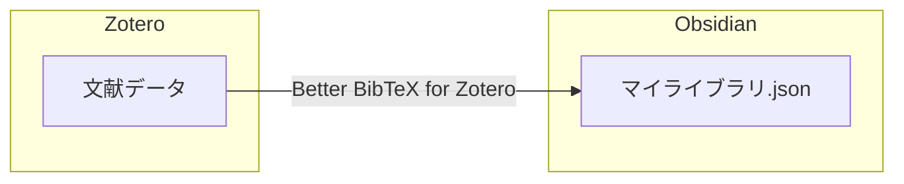
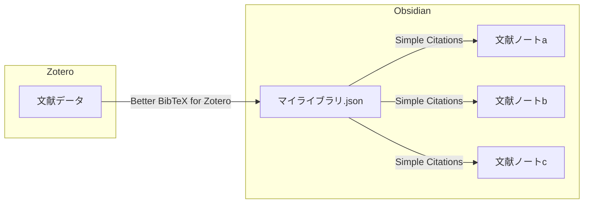
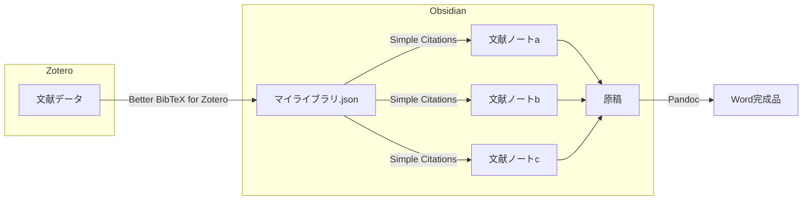
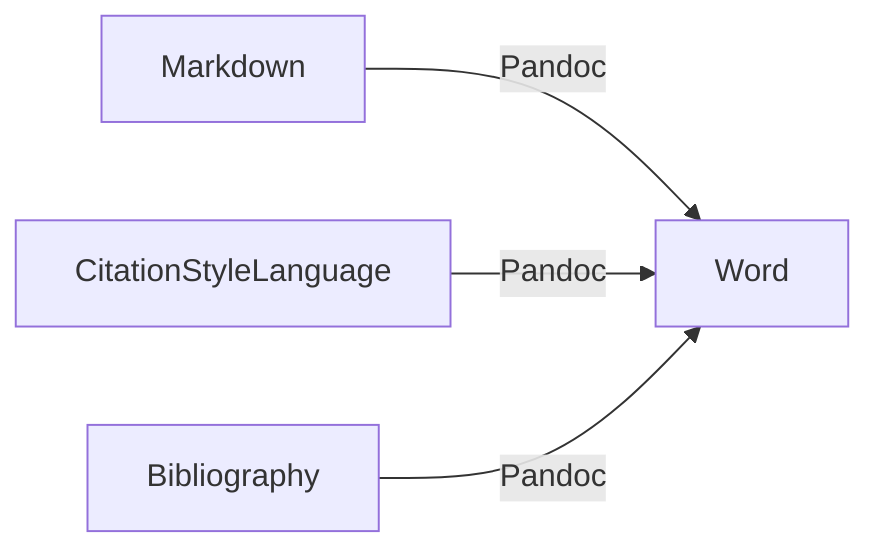
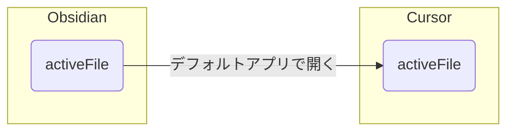

# はじめに

最近になり急激にObsidianが注目を浴び始めた。特にAIエディタのCursorとの連携が強力であると各所で紹介されている。しかし、流行り物の宿命か、多くは表面的な紹介にとどまり具体的な使用例はなかなか見えてこない。本当は、長期スパンでどう使われているのかという点が重要だろう。私は2年ほど前からObsidianを活用してきており、そこそこ活用方法は熟成されてきているので、本記事では私の使用方法を紹介しようと思う。

前提として、私は某科の専門医を取得してから大学院に入学した医学系大学院生である。つまり(生粋の研究者畑というわけではないが)研究者向けの使用例となる。

# ZOC連携の完成例

本記事ではZotero×Obsidian×Cursorの3つのアプリの連携を解説する。以降ZOC連携と呼ぶ。ディアルディスプレイで2画面を使用し、下記のように配置して使用している。


1画面目：左半分にZoteroで文献のPDFを開き、右半分にObsidianでその文献用のノートを開く。ここに自由にメモを取ることができる。


2画面目：CursorでObsidianの文献ノートを同時に開き、AIにZoteroのPDFを読ませて表作成などのノート編集を行うことができる。

Zoteroは文献管理アプリ、Obsidianは高機能メモアプリ、CursorはAIエディタである。このような役割が異なる3つのアプリをシームレスに連携することが本記事の目指すところとなる。

# Z→O連携(Zotero→Obsidian)

## ZoteroとObsidianをインストール

- [Zotero | Your personal research assistant](https://www.zotero.org/)
- [Obsidian - Sharpen your thinking](https://obsidian.md/)

上記リンクからインストールする。

## Zoteroとは

Zoteroとは無料オープンソースの文献管理ツールである。文献のPDFを入れておくと文献データベースとして管理してくれる上に、PDFビューワーとしても使用できる。


文献の追加方法は

1. [Zotero Connectors](https://www.zotero.org/download/connectors)(ブラウザ拡張機能)を使う
2. PDFを直接ドラッグ＆ドロップ
3. Zotero内の｢Add file｣ボタンからPDFを追加

などがあり、簡単に文献を追加できるようになっている。単独でも十分便利だが、その真価は豊富なアドオンとAPI(外部からプログラムでアクセスできる仕組み)にある。本記事ではそれらを有効活用することになる。

## Better BibTeX for Zoteroの設定

ここではZoteroのアドオンの「Better BibTeX for Zotero」を使用する。

まずはインストール→[Better BibTeX for Zotero](https://retorque.re/zotero-better-bibtex/installation/)

インストールしたら｢マイ・ライブラリ｣を右クリック→｢エクスポート｣を押すと、下記の用に表示される。


Better CSL JSON 形式でを選択し、｢Keep updated｣にチェックを入れる。次に出力箇所を指定できるので、Obsidianのフォルダを指定する。

これでZoteroのマイ・ライブラリの文献データがメタデータも含めてBetter CSL JSONという形式で出力される。この出力は自動更新なのでZoteroに文献が追加されたり変更されるたびに自動で更新される。



ここではZoteroの文献データを自動的にObsidian内のjsonファイルに出力するという設定を行っている。

## Obsidianの設定

この文献データが自動出力されたデータを読み取って、Obsidian上に文献ノートを自動生成するObsidianのプラグインを自作した。公開されており、詳細の使い方は下記READMEに記載してある。

> [!quote] [Simple Citations](https://github.com/masaki39/simple-citations)

### Simple Citationsのインストール

下記の手順でObsidianにインストールする。

1. Obsidianの設定画面
2. コミュニティプラグイン
3. コミュニティプラグンを有効にする
4. 閲覧
5. Simple Citationsと検索しインストール
6. 有効化

### Simple Citationsの設定

とりあえず上の3つを設定すれば動くようになっている。


上から順に

- 先ほど出力したjsonファイルへの相対パス
- ノートの出力先フォルダの設定
- 自動でノートを生成するかどうかのチェック

との設定となっている。`Add literature note`というコマンドが追加されるので、手動でノートの追加コマンドを実行しても良い。


その他、著者タグやjournalタグの追加、abstractの追加などのオプションが用意してある。


Zoteroに文献を追加するとObsidianにこのような文献ノートが自動生成される。DOIリンクをクリックすると元論文のサイトに飛ぶことができるし、ZoteroのURIスキームをクリックするとZoteroが開きその論文が選択されるようになっている。



ここまでの設定で上記のような自動化フローが作成された。

## Z→O連携でできること

まず、最もシンプルな使用方法は文献ノートにメモを残すということだ。読んだ内容をまとめてもいいし、疑問点を記載してもいい。それらの文献ノートの管理方法はユーザーに一任される。Obsidianらしさを追究するならば

```
[[文献ノート]]によると~には~のようなリスクが有る
```

といったような用にリンクをつなげたメモを作っていってもいい。もしくは、シンプルにタグで分類･収集していっても良い。

### Dataviewで一覧表示にする

Obsidianを使う上で個人的に外せないコミュニティプラグインがDataviewだ。DataviewはObsidian上のファイルを簡単に抽出してテーブルなどの形式で表示することができる超人気プラグインだ。[Add literature note](https://github.com/masaki39/simple-citations/blob/main/assets/%E7%94%BB%E9%9D%A2%E5%8F%8E%E9%8C%B2%202025-03-25%2020.50.50.gif)コマンドの動画にも少し写っているが、コードブロックに`dataview`と打って表示したい項目を羅列するだけで綺麗なテーブル状に表示してくれる。例えば、下記のようなコードブロックをノート内に記載すると追加した文献ノートがテーブル状に一覧表示される。

````
```dataview
table without id 
authors[0] as FirstAuthor, journal, year, title, 
link(file.name, "Note") as Note,
elink(zotero,"Zotero") as Zotero,
elink(doi,"DOI") as DOI
from "Literatures" // set the folder name of the literature notes
sort file.ctime desc
limit 100
```
````

詳細な記法は[Dataviewの公式ドキュメント](https://blacksmithgu.github.io/obsidian-dataview/#how-to-use-dataview)を参考にすると良い。

### Dataviewjsで更にカスタマイズする

Dataviewの基本機能は誰だも簡単に使えるように工夫がされているが、JavaScriptの記法を用いてより高機能な表を作ることもできる。Dataviewの設定画面から`Enable JavaScript queries`をONにすると使用できる。

さらに、Dataviewには外部のファイルを読み込むような機能も提供されている。私の場合は検索機能とページング機能が欲しかったので、その機能のテンプレになるようなファイルを作成し、基本的にはそれをベースに使用している。

このファイルは[Github Gist](https://gist.github.com/masaki39/ce8c065ca822902b7428e8529bae3e88)にて公開している。やや高度かもしれないので、詳細な使用方法は本記事では割愛するが、リンク先に記載してある。


上記は私のDataviewの画面の一例である。

### Excalibrainで可視化する

また、リンクをシステマチックに使用するコミュニティプラグインにExcalibrainがある。このプラグインはノート間の関連性を６方向に割り当てて可視化することができる。例えば、ノートの先頭にあるプロパティに親子関係にあるような文献を登録しておく。

```yaml
children: [[他の文献ノート]]
```

するとchildrenに登録したノートが下方向に表示されるようになる。


このExcalibrainをメインに関係性を構築していくような運用をされている方もいるようだが、私の場合は｢これあの論文の続きじゃない？｣というような気づきを保存するための備忘録的な使用に留まっている。

### Pandocを使った引用リストの作成

Simple Citationsには `Pandoc Citeproc Excution(docx)`というコマンドを搭載してある。これはPandocというツールを用いて、文献ノートをReferenceとして再利用してワードに出力するコマンドだ。つまり、論文の原稿をObsidianで書いて、引用文献として文献ノートのリンクを貼っていけば完成品のワードファイルを出力することができる。


コマンドの実行例の画面と


出力されたワードファイルである。

Journalごとのスタイルの違いは[Zotero Style Repository](https://www.zotero.org/styles)からJournalごとのスタイルを規定するファイルのURLを取ってきて

```yaml
csl: https://www.zotero.org/styles/spine
```

と言うように指定する。



このコマンドにより上記のようなフローが達成されたことになる。面倒な引用作成作業が自動化される。

#### Pandocコマンドの設定

Pandocコマンドは使用前に簡単な設定が必要である。

1. [Pandoc - Installing pandoc](https://pandoc.org/installing.html)からPandocをインストール
2. Simple Citationsの設定画面を開く
	1. Pandoc pathを設定
	2. 出力先のフォルダを設定


Simple Citationsの設定例。Macならターミナルで`which pandoc`、Windowsならコマンドプロンプトで`where pandoc`とうつとPandocのpathが分かる。

#### Pandocコマンドの仕組み

このセクションは興味がなければ読み飛ばしても構わない。

PandocのコマンドはPandocのciteprocという機能を使用している。citeprocはマークダウンファイルとJournalごとのスタイルを規定するCitationStyleLanguage(CSL)とBibliography(CSL JSON)をもとに引用を自動整形、生成する仕組みとなっている。



引用はPandocのフォーマットで記載しないといけないが、Pandocのフォーマットは

```
[@citation-key]
```

であるのにたいし、Simple Citationsで作成した文献ノートのリンクは

```
[[@citation-key]]
```

となるようにしているので、簡単な置換を挟んでPandocを走らせればうまく機能するようになっている。つまりSimple CitationsはPandoc citeprocとCSLのエコシステムを最大限利用するように設計されている。

# O→C連携(Obsidian→Cursor)

次にObsidianとCursorの連携の仕方について解説する。最近話題なのはこのO→C連携の部分だが、話題であるのにはそれなりに理由があって、要するに簡単なのである。

## Cursorのインストール

- [Cursor - The AI Code Editor](https://www.cursor.com/ja)

上記からインストールする。

## デフォルトアプリの設定

Cursorの使用方法でよく紹介されているのはObsidianのVault(フォルダ)をCursorで開くというやり方だ。加えて、Obsidianで開いているファイルを素早くCursorで開く方法がある。


使用しているパソコンのマークダウンファイルを開くデフォルトアプリをCursorにしておけば、標準搭載の`デフォルトアプリで開く`コマンドでObsidianで開いているファイルをCursorに送り込むことができる。



私は、Obsidianを基本としてAIのパワーを借りたいときにこのコマンドを使用してCursorにファイルを送り込むようなやり方を取っている。

## O→C連携でできること

Cursorには大きく分けて補完機能、チャット機能、編集機能の３つがある。AIにObsidianで保存した情報について尋ねるもよし、ファイルの作成や編集を任せるもよし、この圧倒的自由度が話題の理由だろう。

私の場合は｢こんなファイルなかったっけ？｣と聞いたり、まとめた情報の編集(表にするなど)をしたり、翻訳･校正をしたりするような使い方が多い。

# C→Z連携(Cursor→Zotero)

こうなってくると、Cursorで文献ノートを開いたときにZoteroのPDFも参照してほしい。論文を毎回細部まで読むのは結構大変なので、AIがPDFに関する質問に答えてくれるととても助かる。この機能をMCPサーバーを用いて実現する。

## MCPサーバーとは

MCPはmodel context protocolの略称で、2024年11月26日にClaudeを開発するAnthropic社が発表したオープンプロトコルである。

> [!quote] [Introducing the Model Context Protocol \ Anthropic](https://www.anthropic.com/news/model-context-protocol)
>

簡単にいうと、AIにAPI(外部からアプリなどを操作する仕組み)の仕様書のようなものをMCPサーバーで提供し、AIがAPIを活用できるようにする仕組みとなっている。AIに外部連携の追加機能をもたせることができる。

## MCPサーバーの設定

Cursorはいち早くMCP対応しており、MCPの設定ファイルに少し追記するだけでAIに様々な追加機能をもたせる事ができるようになっている。設定ファイルは`Cursor Setting`を開き、`MCP`のタブを開き、`Add new global MCP sserver`のボタンを押すと開くことができる。


MCPの設定画面

例えば、設定ファイルの`mcp.json`に下記のように追記するとfetchという機能が追加され、URL先のコンテンツを取得する機能が追加される。

```json
{
  "mcp": {
    "servers": {
      "fetch": {
        "command": "uvx",
        "args": ["mcp-server-fetch"]
      }
    }
  }
}
```

commandの実行が`uvx`となっている場合は[uv](https://docs.astral.sh/uv/getting-started/installation/)のインストールが必要となる。実行方法によって必要なツールがnode.jsだったりDockerだったり、異なっていることに注意が必要である。発表から半年あまりではあるが、相当数のMCPサーバーがすでに公開されている。

- [modelcontextprotocol/servers: Model Context Protocol Servers](https://github.com/modelcontextprotocol/servers)
- [MCP Servers](https://mcp.so/)
- [punkpeye/awesome-mcp-servers: A collection of MCP servers.](https://github.com/punkpeye/awesome-mcp-servers)
- [Smithery - Model Context Protocol Registry](https://smithery.ai/)

## ZoteroのローカルAPI

今回はZoteroのローカルAPIを使用する。設定画面から`Allow other appllication on this computer to communicate with Zotero`のチェックを入れる。


こうすることで、ZoteroをPCで起動中に限りローカルAPI経由でZoteroに外部のプログラムからアクセスできるようになる。

## 自作したMCPサーバー

ZoteroのローカルAPIにアクセスするMCPサーバーを自作した。

> [!quote] [masaki39/zotero-mcp](https://github.com/masaki39/zotero-mcp)

記事作成時点(2025-05-13)では3つの機能を追加できる用になっている。

| mcpツール名             | 機能                                          |
| ------------------- | ------------------------------------------- |
| zotero_search_items | Zoteroのアイテムをauthor名やタイトル名で検索し情報を取得する(30個まで) |
| zotero_get_item     | item keyを用いてアイテムの詳細を取得する                    |
| zotero_read_pdf     | item keyを用いて登録された最初のPDFのフルテキストを取得する         |

追加方法は`mcp.json`に下記の用に記載する。

```json
{
  "mcpServers": {
    "zotero-mcp": {
      "command": "uvx",
      "args": ["masaki39-zotero-mcp"]
    }
  }
}
```

動かすためには[uv](https://docs.astral.sh/uv/getting-started/installation/)が必要となっている。

> [!caution] 初回起動時
> これに限らずuvxやnpxは初回起動が重くてエラーが出る可能性がある。
> ターミナルやコマンドプロンプトなどで`uvx masaki39-zotero-mcp`を実行しておいて、初回起動を済ませておくとうまくいくことが多い。

## 自作が必要である理由

MCPサーバーはすでに大量に公開されているが、基本的には公式のもの以外は使用しないほうがいいのではと思っている。特にuvxやnpxなどで起動するmcpサーバーは必要なパッケージを一時的にダウンロードして即使用するような仕様になっているので悪意に弱い。たとえば、上記に記載した私が自作の`zotero-mcp`もGitHubのリポジトリから都度ダウンロードして使用するので、もし私が悪意のある変更を施した場合に対応できない。MCPは外部のファイルシステムにもつながることができる分、扱いは慎重になるべきだろうと思う。

公式ドキュメントが親切かつ、自作自体は簡単にできるようになっているので、基本的には自作を推奨する。

> [!quote] [[📘MCPサーバーを自作してみた]]

## itemKeyをObsidian内に自動インポートする

ZoteroのAPIを実際に使用してみると、Zoteroの全てのitemにはitem keyが設定されておりitem keyを中心にAPIを動かすような仕組みになっていることが分かった。そのため現状のmcpサーバーでは文献ノートを開いても`zotero_search_items`でその文献のitem keyを取得してからしか、`zotero_read_pdf`を実行できない。AIはそのへんはちゃんと分かっていて｢pdf読んで｣みたいな適当な指示でもこの2段階の作業をやってくれるが、最初からitem keyが文献ノートに含まれたほうが望ましいだろう。

### Better BibTeX for Zoteroの設定

Zoteroの設定画面から`Better BibTeX`→`postscript`の欄に移動し

```js
if (Translator.BetterCSLJSON) {
  csl.key = zotero.key;
}
```

と記載する。これでBetter CSL JSONにkeyという欄が追加されitem keyが自動出力されるようになる。

### Simple Citationsの設定

設定の`Optional fields`に`key`と記載するとBetter CSL JSONのkeyの欄を読み取るようになる。こうすると文献ノート内にitem keyが追加される。

### Cursorの設定

`Cursor Settings`→`Rules`→`User Rules`に

```
zoteroの機能を使用する際にフロントマターにkeyがある場合は、それをitemkeyとして使ってください。
```

というように記載すればAIは一発で`zotero_read_pdf`を使用するようになる。

## C→Z連携でできること

CursorがZotero内の文献のPDFを読めるようになるので、論文を細部まで毎回読み込む必要がなくなる。Figureを中心に読みたいところを読んで気になるところをAIに聞いたり、結果をきれいにまとめてもらったり、色々な使い方が考えられる。


結果の表をテキストでまとめてもらうのも便利。

# おわりに

以上が、現在私が使用しているZOC連携の全容である。基本的にはObsidianを中心に回っていることが分かる。ObsidianはAIフレンドリーとして現在注目されているが、AIフレンドリーというよりプログラムフレンドリーといったほうが正しく、その1つにAIが含まれると思っている。本サイトも、Obsidianのノートをワンコマンドで公開するような仕組みを使用している。バニラな状態では物足りなく感じるかもしれないが、｢どうにでもできる｣土台を提供しているとも言える。何でもできる分、何がしたいかが重要であるし、この複雑に見える連携も最初は小さく始まって、｢こういうの実現できるかも｣を2年間繰り返した結果である。長く使うと自分に馴染んでくるので是非使い込んでほしい。
