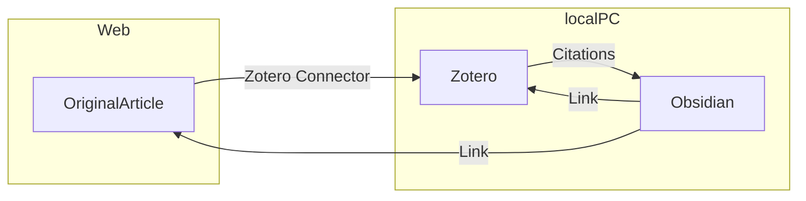

# はじめに

論文を読む際に文献管理をどうするか、どのツールを使用するか
これは多くの人が悩むことだと思われる

熟考の末に、安くかつ汎用性や拡張性に富む方法として、**Zotero×Obsidian**の組み合わせが優れているのではと考えて半年間使用した

十分に人に勧められるものであると判断し、まとめることにした

# 文献管理ツールとは

文献管理ツールはその名の通り文献のデータを整理するツール

- Mendeley
- EndNote
- Paperpile

などがメジャーだが、他にも数多く存在する
料金形態がそれぞれ異なる
この 3 つのうち、Mendeley は基本無料だが EndNote と Paperpile は有料である
Mendeley を含む**無料のものは大抵クラウドストレージに制限**があり、データが増えてくると課金が必要になる

機能としては

1. PDF や文献のメタデータ (journal 名など) をデータベースとして保存する
2. Web サイトから文献のデータをインポートする
3. Word で引用文献リストを自動で作成する

この 3 つが最も重要であり、どのツールも使い勝手の差はあれど搭載している

# Why Zotero

Zotero はオープンソースの文献管理ツールであり、**基本無料**である
上記の 3 機能は全て搭載しており、他のツールと比較して

- PDF viewer も兼ねており、それが優秀であること
- アドオンの拡張性が高いこと
- 別にクラウドストレージを持っていれば無料で使い放題なこと

が大きな利点である

特にアドオンの中でも
PDF viewer に翻訳機能を追加できる「Zotero PDF Translate」と
文献のメタデータを出力できる「Better BibTex for Zotero」
が強力なツールとなる

# Zotero の基本機能

## 1. PDF や文献のメタデータ (journal 名など) をデータベースとして保存する 

まずはこの機能は普通にアプリをダウンロードするだけで使用可能である
[Zotero | Your personal research assistant](https://www.zotero.org/)


UI は若干古い感じで、左側にフォルダを作成できる
右側には文献のメタデータが表示される
Zotero の特徴として

**文献に PDF 以外のファイルをなんでも追加できる**

というものがあり、文献に関連するスライドや画像などもとりあえず突っ込んでおくことが可能である


Viewer はこんな感じでシンプル
注釈やマーカーやメモなど、一通りのことはできる

## 2. Web サイトから文献データをインポートする

これは Chrome の場合、「Zotero Connector」という拡張機能で可能となる
[Chrome ウェブストア - 拡張機能](https://chrome.google.com/webstore/detail/zotero-connector/ekhagklcjbdpajgpjgmbionohlpdbjgc?hl=ja)

文献のページでこの拡張機能のボタンを押すだけで自動的に文献のメタデータと PDF が Zotero に追加される

また PDF が既にある場合、**Zotero に PDF をドラッグして入れるだけ**でも自動的にメタデータを収集して文献として追加することができる

## 3. Word で引用文献リストを自動で作成する

これは「Zotero Word Processor Plugins」で可能になる
このプラグインは**Zotero の初回インストール時に自動的に Word にインストール**される


Word に Zotero タブが追加される
詳細な使い方は省略するが、

- 指定の形式 (Journal に応じて予め指定) で文献を挿入する
- 文献の番号を登場順に自動的に並べ替える
- 指定の形式で引用文献リストを自動的に作成する

などの機能がある
私は Mendeley からの移行だが、正直 Mendeley の方が UI の使いやすさは上だった
ただ、不便するほどでもなく実用範囲内だと思われる

# Zotero PDF Translate

PDF viewer はそのままでも実用に足るのだが、アドオンで翻訳機能をつけると使い勝手がかなり良くなる

[GitHub - windingwind/zotero-pdf-translate: Translate PDF, EPub, webpage, metadata, annotations, notes to the target language. Support 20+ translate services.](https://github.com/windingwind/zotero-pdf-translate)

GitHub の README を見ながらなら簡単にインストールできる


選択範囲内を自動的にポップアップで翻訳してくれる
そのままコピーしたり注釈にしたりすることができる
長い文章も一気に翻訳可能である


設定画面
翻訳は Google 翻訳がデフォルトだが、DeepL の API を取得すれば DeepL も使用可能である
便利すぎて無料分が一瞬で溶けるので注意が必要

# Zotero をクラウドストレージで同期

Zotero はローカルでの使用のみなら完全無料だが、クラウドで他のデバイスと同期するとなると 300MB しか無料分がなく、本格的に使用すると課金必須である
ただし、他のクラウドと組み合わせることで使い放題となる

(他にもあるかもしれないが) 選択肢は主に 2 つ

1. WebDAV の機能をもつクラウドストレージを別に用意する
2. アドオンの「ZotFile」を使用して PDF だけ別のクラウドストレージに移動させる

調べるとそれぞれ別途解説記事が見つかる

1 については
[Zotero & WebDAV（クラウドストレージ）で同期できる無料の文書管理・論文管理の環境を作る - Qiita](https://qiita.com/aizakku_nidaa/items/d4ee463e309dad5759a7)

Zotero は WebDAV という機能をサポートしており、この機能がついているクラウドストレージは公式のものと同様に使用可能である
文献管理程度であれば無料分の容量でも十分足りると思われる

2 については
[論文を読むフローを整理した｜Zotero + ZotFile + Dropbox | 飽き性の頭の中](https://blog.tawa.me/entry/zotero-dropbox)
ZotFile というアドオンは Zotero から PDF だけを抽出して指定の場所 (クラウドでも可) にきれいにフォルダ分けして保存することができるアドオンである
PDF 抜きなら無料の 300MB でも十分足りるでしょという発想

**おすすめは 1 で WebDAV を使用する方法**
2 の方法は ZotFile がインストールされたデバイスでしか PDF にアクセスできなくなる
iOS は ZotFile がサポートされていないので PC でしか使用できなくなる

ちなみに ZotFile には PDF をきれいに Rename する機能もついているので、私はその目的だけでインストールしている

# pCloud

WebDAV 対応のクラウドストレージは複数あるが、個人的なおすすめは pCloud である

pCloud はスイスのクラウドストレージのサービスで
**生涯買い切りプラン**を売りにしている

機能的にも十分で 3 年ほどの使用で元が取れるのでクラウドストレージに困っている場合は購入をおすすめする

インフレに伴い徐々に値上げしており今後も徐々に値上げが予想される
私が購入した 2020 年ブラックフライデーは 2TB245 ドルだった
**ブラックフライデーなど年に数回大幅に値下げする**ので値下げ時に購入するとよい

> [!NOTE]　WebDAV 利用方法
> 
> 下記を連携アプリに入力する
> 
> 1. URL(どちらかから選択)
> 	- US サーバー: https://webdav.pcloud.com  
> 	- EU サーバー: https://ewebdav.pcloud.com
>
> 2. ユーザー名: アカウントのメールアドレス
> 3. パスワード: アカウントのパスワード

> [!caution]
> google 連携でアカウントを作ると pCloud 用のパスワードが設定されないので「パスワードを忘れた方へ」から再設定する必要がある

# 文献管理の方法論

ここまでは Zotero の使用方法を解説した
Zotero だけでも十分に使用に耐えるので、ここまでで留めておいても良い
ここからは文献データの管理方法について解説する

文献データ (というかデータ全般) の管理方法には複数の方法がある

- 単純にフォルダ分けをする
- タグを付ける
- データベースとして管理する

単純なフォルダ分けとタグ付けは Zotero や他のツールでも使用可能である
Evernote を使用したことはあるだろうか
この方法は、一定数以上のデータが集まってくると限界がやってくる
タグ付けは面倒くさいし、フォルダはどこが最適か分からなくなる
私もかつては Evernote ユーザーだったがノートが 1000 くらいになってから徐々に使わなくなった

データベースとして管理する
これは Evernote の後に流行ったメモアプリの Notion が得意とする方法で、データにタグやプロパティ (メタデータ) を設定してそれを元に絞り込んだり並べ替えたテーブルを作って表示する
この方法はフォルダ分けよりも合理的に必要なデータを抽出できるが、プロパティ (メタデータ) の入力が面倒くさい
しかし、**文献データには Journal や出版年数、author などのメタデータが既に含まれている**ため、文献管理とは噛み合った方法と思われる

そのため、Zotero から文献データを出力して、そのメタデータを元にデータベース管理するのが良いのではと考えた

ツールとしては Notion もありだが、より次世代のメモアプリである Obsidian を採用した
Notion とは一長一短な部分もあるが

- より軽量である
- より拡張性が高い
- MOC という概念での管理も兼ねることができる

この点から Obsidian を採用した

Notion を使用する場合は「Notero」というアドオンを使用するらしい
[Zotero を使おう│Lui Yoshida Lab](https://edulab.t.u-tokyo.ac.jp/zotero/)

# Obsidian について知っておくべきこと

Obsidian はメモアプリだが基本的にフォルダは使用しない
ページ間リンクを簡単に設定できるので、自分だけの wikipedia みたいな使用方法ができる


MOC という概念は map of contents の略で、ノートのリンク集のようなノートを複数作成してコンテンツを管理する方法である

今までのフォルダ分けと異なり、回帰構造や重複支配もなんでも許容する自由なデザインが可能になっている
一応、今までのメモアプリのようなフォルダ分けやタグ付けも可能となっている

また、Notion のプロパティもしくはメタデータに相当する情報を、フロントマターと呼ばれるノートの冒頭の領域に YAML 形式で管理している

```
---
title:
---
```

ノートの頭に --- で囲った領域を作成して、好きな名称の key を設定してメタデータとする

今回は、文献ごとにノートとして取り込んでメタデータをフロントマターで管理していくようにする
この方法のメリットは任意の key を好きなだけ追加できることである

もし、study design についての情報を追加したい場合は

```
---
title:
design: RCT
---
```

手動にはなるが、必要な情報があればこのようにどんどん追加することができる

ver.1.4 から UI がクリックして選択していくプロパティ表示に変化したが、~~従来通りの YAML 形式の方が編集が楽なので設定で戻すと良い~~
2024-02-05 追記: 
意外とプロパティ表示も悪くないので、ホットキーに `⌘+Shift+S` でソースモードに切り替えるホットキーを設定して適宜切り替えれるようにした

> [!NOTE] 従来の表示方法への戻し方
> 
> 設定→エディタ→Properties in document→Source

# Better BibTeX で Zotero からメタデータを自動出力する

ここでは Zotero のアドオンの「Better Bibtex for Zotero」を使用する
まずはインストール
[Better BibTeX for Zotero](https://retorque.re/zotero-better-bibtex/installation/)

インストールしたら
マイ・ライブラリを右クリック→エクスポート


Better CSL JSON 形式で OK
次に出力箇所を指定できるので、**Obsidian のフォルダを指定して**出力する

これで Zotero のマイ・ライブラリの文献データがメタデータも含めて Better CSL JSON という形式で出力される
**この出力は自動更新**なので Zotero に文献が追加されたり変更されるたびに自動で更新される

# Citations で Obsidian にメタデータをインポートする


Obsidian の「citations」というコミュニティ・プラグインを使用する


インストールしたら設定から参照するデータベース (先程自動出力設定したマイ・ライブラリ.json) を指定する

```
---
tags:
title: "{{title}}"
authors: [ {{authorString}} ]
journal: "{{containerTitle}}"
year: {{year}}
doi: "[Go To Article](https://doi.org/{{DOI}})"
zotero: "[Go To Zotero]({{zoteroSelectURI}})"
---
[Go To Article](https://doi.org/{{DOI}})
[Go To Zotero]({{zoteroSelectURI}})

```

これは私が使用しているテンプレート
設定のテンプレートにインポートしたいメタデータを YAML 形式で記載しておくことができる
このように title や doi リンク、zotero へのリンクなどを設定可能である

ここまで設定したら、ショートカットを使用して**ワンタッチで文献データをノートとしてインポートできる**様になる
このノートにはテンプレートに設定したメタデータが YAML 形式で含まれる様になる

インポートしたノートはどのように管理しても良い
とりあえず 1 つの MOC にまとめてもいいし、好きに分類しても良い
文献ノートにメモを記しても良い
Obsidian の売りは自由度の高さにある

> [!info] ~~2023-12-06 追記~~
> ~~Citations プラグインで authors が分割されない問題を Templater で解決してみた記事~~
> ~~First author を抽出したいなら~~
> [📘Templaterでフロントマターを書き換える](📘Templaterでフロントマターを書き換える.md)
>
> > [!info] 2024-02-05 追記
> > authors の前後に [] を書くだけで配列として認識されることに気がついた

# インポートしたノートをデータベース管理する

次にインポートしたデータをデータベースとして管理する
メタデータを元に自動的に table を作ることができる素晴らしいコミュニティプラグイン「dataview」を使用する

使用方法は別記事に記載

> [!seealso] Seealso
> [[📘Dataviewの使い方]]

dataview を使用して、抽出したい table を設定したら完成

# 完成した全体像



simple に書くとこのような構造になる
記事を Zotero→Obsidian と順に取り込んで、Obsidian で管理する

他のデバイスでも使用する場合は
Zotero の同期に WebDAV を使用する
~~Obsidian の同期方法は多岐にわたるので本記事では解説しないが、Apple user ならば iCloud が最も楽なので私は iCloud を使用している~~

[Obsidianの複数端末同期方法まとめ (Mac/Windows/iOS/Android)](https://pouhon.net/obsidian-sync/6796/)

> [!info] 2024-02-05 追記
> より良い同期を求めて Self-hosted LiveSync に移行した
> 設定難易度はかなり高いが、やる価値あり
> [[📘Self-hosted LiveSyncの初期設定]]

# 最後に

かなり複雑に思えるかもしれないが自動化出来ている工程が多いので、最終的な完成形では

Zotero にインポート→Obsidian でショートカットでノート作成

これだけでデータベースが完成し、予め dataview で設定した table に反映されるようになる
個人的には現時点での無料最強構築ではないかと思っている
時間があればこの環境構築を一回行ってみてほしい
