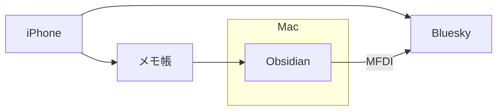

# はじめに

数ヶ月前に実は廃止していたObsidianのデイリーノートを、最近復活させた。デイリーノートを廃止させていた理由は、

- とりあえずメモとしてはApple純正のメモ帳の方が軽くて使いやすい
- スマホのObsidianがちょっと重い
- Apple純正のメモ帳だと、ロック画面からメモできるし、同期も軽快

ということだった。以前[[📘Apple純正メモ帳の環境を整える]]という記事を書き、Apple純正のメモ帳の内容を特定のページに表示させる方法を考案したが、これができるならデイリーノートに取り込むことも可能ではと考えた。要するに、日中はiPhoneでメモをとって、一日の最後に取り込むということ動きが出来ないかということだ。

# メモをとるショートカットアプリ

前回同様、ショートカットアプリというビジュアルプログラミングアプリを使用してメモをすることでフォーマットを整える。ショートカットアプリの起動はロック画面からも可能なので手軽さも上がる。詳細な解説は省略、iCloud共有リンクを下記に貼っておく。

- [メモ投稿](https://www.icloud.com/shortcuts/6dce55b14da745218cac9058032c0452)

このショートカットでメモをとるとタイトルに時刻が自動入力される。

```
2024-08-07T06:34:19+09:00
テスト
```

私が使用しているSNSであるBluesky投稿パターンは下記

- [Bluesky投稿](https://www.icloud.com/shortcuts/59ca3571f4ac440eaf711509ea4aa746)
- [メモ&Bluesky同時投稿](https://www.icloud.com/shortcuts/e425e27abb544a46af5e04295d25abfc)

これは[iPhoneのショートカットからBlueskyに投稿するレシピを作った | t_mlog](https://t-m-log.blogspot.com/2023/12/iphonebluesky.html)を参考にしている(リンク先のショートカットには言語登録がなかったのでそこを追加しただけ)。

# 投稿をコピーする

フォーマットが統一されるので、本日の投稿のみを抽出してコピーすることも容易である。

- [本日の投稿をコピーするショートカット](https://www.icloud.com/shortcuts/15d2dfbb8ff34388a6b004e5c7ad6b8b)

本日の日付を含む投稿が下記の形式でクリップボードにコピーされる。

```
2024-08-07T06:34:19+09:00
テスト
2024-08-07T07:34:19+09:00
テスト2
2024-08-07T08:34:19+09:00
テスト3
```

一日の最後に、このショートカットをMacでクリックしてデイリーノートに貼り付けることで、スマホの投稿をObsidianに保存することができる。

# Templaterで変換する

Obsidianでデイリーノートとメモ、Bluesky投稿などを行うなら[Mobile First Daily Interface](https://github.com/tadashi-aikawa/mobile-first-daily-interface)が便利である。このコピーしたメモをプラグインの形式に変換して貼り付けることも可能だ。形式が決まっているなら正規表現でマッチして変換するということが容易にできる。

下記はTemplaterのスクリプトである。

```js
const clipboard = await tp.system.clipboard();
const regex = /(\d{4}-\d{2}-\d{2}T\d{2}:\d{2}:\d{2}\+\d{2}:\d{2})(.*?)(?=\d{4}-\d{2}-\d{2}T|$)/gs; 
const formattedText = clipboard.replace(regex, '\n````fw $1$2````\n'); 
tR += formattedText;
```

コピーしたメモを貼り付けるときに、このTemplaterコマンドで貼り付けると自動でMFDIの形式に変換される。これによってMFDIのインターフェースからも取り込んだメモを扱うことができる。



# おわりに

デイリーノートを復活させた一番の理由は、実は[Silhouette](https://github.com/tadashi-aikawa/silhouette)プラグインの導入なのだが、ついでにメモ環境もアップグレードできた。
