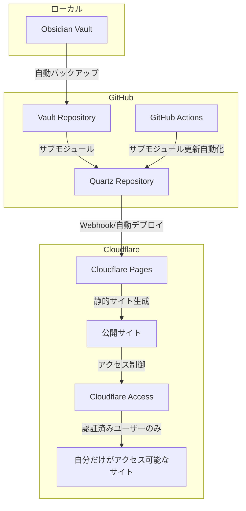

# はじめに

> [!quote] [📘Obsidianのその同期 本当に必要ですか？ - Minerva](https://minerva.mamansoft.net/2025-07-24-obsidian-sync-necessary)

こんな記事を読んだ。100%同意しかない記事だった。同期は確かに殆どの場合でいらないので、私も結局同期はせずにPCでしか使用していない。

> 情報の参照はObsidian Publishで事足りたから

確かに参照はしたい。できたら非公開で。
そこで、自分だけがアクセスできるサイトにする方法を考えた。

# 全体像

VaultをGithubに自動バックアップし、VaultをOSSのQuartzのリポジトリのサブモジュールに設定する。Cloudflare Pagesにデプロイし、Cloudflare Accessで認証をかける。サブモジュールの更新をGithub Actionで自動化する



# Gitの設定

Gitはファイルの変更を追跡するプログラムである。コミットというセーブポイントを作成することができる。すでにGitを使用している場合はこのセクションは不要。

## インストール

下記をインストールする。

- [Git](https://git-scm.com/downloads)
- [Visual Studio Code](https://code.visualstudio.com)(あると何かと便利)

## Gitの開始

Gitの操作はコマンドラインで行っても良いが、VScodeだと視覚的にGit操作ができるので初心者向け。まずはVScodeでVaultを開く。(画像用はテスト用のVault)


サイドバーから`Initialize Repository`をすると、`.git`ファイルが作成されてGitが開始される。


初期設定では全てのファイルが追跡されるが、Obsidianは雑多になりがちなのでマークダウンファイルだけを追跡するようにしてみる。`.gitignore`というファイルを作成し除外ルールを作る必要がある。


例えば下記のように記載するとマークダウンファイルだけを追跡してくれる。

```
*
!*/
!*.md
.*/
```

変更がリストアップするのでコミットに含める変更を＋ボタンで追加し、初回コミットを行う。


これでローカルでファイルを追跡する準備が整った。

## GitHubの設定

次にバックアップ先のGitHubの設定をする。GitHubアカウントを作成し右上の`New repository`から新規のリモートリポジトリを作成。


Repository nameを入力しPrivateにチェックすると、非公開のリモートリポジトリが作成される。


表示されるQuick Setupの案内に沿ってリモートリポジトリを登録していく。アクセス認証にはHTTPS認証とSSH認証があるが、HTTPS認証のほうが簡単。

### HTTPS認証の設定

初回はユーザー名とパスワードを求められる。**パスワードは通常のGitHubパスワードではなく、Personal Access Token（パーソナルアクセストークン）を使用する。**

1. GitHubの右上のアイコン → `Settings`
2. 左メニューの`Developer settings`
3. `Personal access tokens` → `Tokens (classic)`
4. `Generate new token` → `Generate new token (classic)`
5. `repo`にチェック
6. `Generate token`でトークンを生成
7. **生成されたトークンをコピー（画面を閉じると再表示できない）**

初回プッシュに求められる：
- Username: GitHubのユーザー名
- Password: 生成したPersonal Access Token

## ローカルとリモートをつなげる

VScodeでターミナルを開いて表示されていたHTTPS認証の登録コマンド、初回Pushコマンドを実行する。

```zsh
git remote add origin https://github.com/masaki39/test-vault.git
git branch -M main
git push -u origin main
```

## Obsidian Gitの設定

準備万端になったところで、コミュニティプラグインのGitをインストールする。GitプラグインはObsidian上でGitのコマンドが実行できたり、自動コミットしたりできるプラグインとなっている。私の場合は適当に`Automatic`を設定しているだけにしている。


手動でcommit&syncのコマンドを実行するだけでも問題なく使用できる。

ここまでの設定で、Vaultの変更履歴を自動的に保存しリモートリポジトリにバックアップする仕組みが完成した。

個人的にはObsidianでそこまで変更履歴や差分が必要なことはないし、リモートにバックアップが1個残っていれば最悪問題ない。さらに、徐々にファイル数が膨大になるだろうから、たまに`.git`ファイルを削除して設定し直すことで履歴情報をリセットしてもいいのではと思っている。

# Quartzの設定

> [!quote] [GitHub - jackyzha0/quartz: 🌱 a fast, batteries-included static-site generator that transforms Markdown content into fully functional websites](https://github.com/jackyzha0/quartz)

からUse this template→Create a new repositoryでパブリックリポジトリを作成する。こっちは公開(Public)で良い。今回のRepository nameがサイト名に入るので注意する。


作成されたリポジトリのcontentフォルダをQuartzで公開できるようにしていく。

# Cloudflare Pagesの設定

[Cloudflare](https://www.cloudflare.com/ja-jp/)のアカウントを作成し、ダッシュボードから`Pages`と検索する。CloudflareではGithubのアカウントと連携しできるので先程作ったQuartzのリポジトリを選択してセットアップを開始する。


> [!quote] [Hosting](https://quartz.jzhao.xyz/hosting)

Quartzの公式ページに沿って入力して進める。保存してデプロイする。


これだけでサイトが作成できる。`pages.dev`というドメインになる。Quartzのリポジトリの変更を自動で検知してサイトに自動変換する仕組みとなっている。

20000ファイルまで可能らしいが、私のVaultは4000ファイルぐらいなのでまだ数年は大丈夫そうだ。

# Cloudflare Accessの設定

> [!quote] [Cloudflare PagesとCloudflare Accessで安全にWebサイトを共有する](https://qiita.com/totto2727/items/3b46b1053136f62ec89c)

を参考に、作成したサイトに認証を追加する。

この部分は説明は省略する。というのもPagesのプロジェクトの設定から、案内に沿って設定していくだけであるからだ。

注意点は

- サイトを作成してからしか認証を追加できないので、最初は空の状態でサイト作成する必要がある。
- 2番目のサブドメイン指定なしの設定が必要ということ(上記サイト参考)

デフォルトだと認証対象は自分のメールアドレスのみで、認証方法はメールへのワンタイムパスワード送信のみとなっている。追加で様々な認証方法が用意されており、やり方の案内はかなり丁寧に記載してある。私はGitHubアカウント認証を追加した。


# submoduleの設定

> [!quote] [\[ユースケース\] Obsidian Vault と Quartz を分離した状態で Cloudflare Pages にデプロイする](https://zenn.dev/ganariya/articles/deploy-quartz4-with-submodule)

上記記事を参考にした。QuartzのcontentフォルダにVaultのリポジトリをサブモジュールとして登録する。この設定作業はローカルで作業したいので、Quartzのリポジトリをローカルにクローンする(ダウンロードしてローカルで作業できるようにする)。

```zsh
git clone https://github.com/masaki39/test-quartz
```

クローンしたQuartzのリポジトリをVScodeで開く。下記のような構成になっている。


既存のcontentフォルダを削除して、Gitの履歴も削除する。

```zsh
rm -r content
git rm --cached -r content
```

contentフォルダにVaultのリポジトリをsubmoduleとして追加する。

```zsh
git submodule add https://github.com/masaki39/test-vault content
```

`.gitmodules`というファイルが作成される。

```
[submodule "content"]
	path = content
	url = https://github.com/masaki39/test-vault
```

Cloudflare Pagesがプライベートリポジトリを参照するときにはSSH認証で行っているらしい(設定は不要)ので、このurlをSSH認証に変更する。

```
[submodule "content"]
	path = content
	url = git@github.com:masaki39/test-vault.git
```

これでローカルのサブモジュールの設定は終了となる。

# Quartzの設定(オプション)

`quartz.config.ts`と`quartz.layout.ts`がユーザー設定用のファイルとなっている。公式サイトを見ながら好きにカスタマイズができる。

> [!quote] [Welcome to Quartz 4](https://quartz.jzhao.xyz)

私の場合はビルド時にプラグインでエラーが出たので、`quartz.config.ts`から2つのプラグインをコメントアウトしておいた。


`AliasRedirects`はaliasesのurlも発行してくれるプラグインだが、Vaultのどこかに長過ぎるaliasesがあるようでビルドエラーを出した。`CustomOgImages`はカード型リンクにする時に表示される画像の設定だが、不要な上ビルド速度に影響するらしいのでオフにした。

また、サイトのトップページはIndex.mdというファイルを参照するようになっているので、作成しておく必要がある。

ここまでのローカルリポジトリでの変更をCommit→SyncのボタンでQuartzのリモートリポジトリに反映させる。自動でCloudflare Pagesが変更を検知し、Vaultがサイトとして生成される。


サイトが生成された。今作業していたローカルリポジトリはもう使わないので削除してよい。

# Github Actionの設定

Github Actionはリモートリポジトリ上での動作を自動化をすることができる機能だ。今回は、自動的にサブモジュールを更新するためのGitHub Actionsを設定する。

## Personal Access Tokenの設定

まず、GitHub ActionsがVaultリポジトリを更新できるように、Personal Access Tokenを設定する。先ほどHTTPS認証で行ったのと同様の手順だ。

1. GitHubの右上のアイコン → `Settings`
2. 左メニューの`Developer settings`
3. `Personal access tokens` → `Tokens (classic)`
4. `Generate new token` → `Generate new token (classic)`
5. 与える権限に`repo`と`workflow`にチェック
6. `Generate token`でトークンを生成
7. **生成されたトークンをコピー（画面を閉じると再表示できない）**

次に、QuartzリポジトリでトークンをSecretsに設定：

1. QuartzリポジトリのGitHub画面で`Settings`タブ
2. 左メニューの`Secrets and variables` → `Actions`
3. `New repository secret`
4. Name: `PAT_TOKEN`
5. Secret: 先ほどコピーしたPersonal Access Token
6. `Add secret`

これで、`PAT_TOKEN`を使用することでQuartzリポジトリ上からVaultリポジトリ(プライベートリポジトリ)へのGithub Actionでのアクセスが可能になった。

## ワークフローファイルの作成

QuartzのリポジトリのGitHub画面で`Actions`タブ → `New workflow` → `set up a workflow yourself`から下記のワークフローを作成する。`update-submodule.yml`とした。

> [!quote] [\[ユースケース\] Obsidian Vault と Quartz を分離した状態で Cloudflare Pages にデプロイする](https://zenn.dev/ganariya/articles/deploy-quartz4-with-submodule)

参考にした記事では、Vaultのコミットを検知してSubmoduleの更新をするよう作られていたが、コミットの頻度が多いとビルドも頻繁になるし、そこまで即時性は求めていないので、単純に毎日0時にSubmoduleを更新するコマンドを実行するだけとした。

```yml
# .github/workflows/update-submodule.yml
name: Update Submodule

on:
  schedule:
    # 毎日 0:00 JST (15:00 UTC) に実行
    - cron: '0 15 * * *'
  workflow_dispatch:  # 手動実行も可能

jobs:
  update-submodule:
    runs-on: ubuntu-latest
    
    steps:
    - name: Checkout repository
      uses: actions/checkout@v4
      with:
        token: ${{ secrets.PAT_TOKEN }}
        submodules: recursive
    
    - name: Update submodule to latest
      run: |
        # サブモジュールを強制的に最新に更新
        git submodule update --remote --force

        # 変更があるかチェック
        if git diff --quiet --exit-code; then
          echo "No changes to commit"
          exit 0
        fi
        
        # Git設定
        git config --local user.email "action@github.com"
        git config --local user.name "GitHub Action"
        
        # 変更をコミット
        git add .
        git commit -m "Auto-update submodule to latest commit"
        git push
```

# おわりに

この仕組みのすごいところは、無料なうえに完全リモートで自動化しているところとである。設定の難易度としては、私は元々GitもQuartzも使っていたのでそこまで難しく感じなかったが、一からとなるとかなり複雑に感じるかもしれない。QuartzやCloudflareの周りは簡単だが、Git周りは書いてみるとやっぱり複雑だなと感じた。しかし、一度構築すれば**ほぼメンテナンスフリー**で動作するため、初期設定の複雑さを乗り越える価値は十分にあるだろう。

どのデバイスでもVaultを参照できるようになるメリットは非常に大きいだろう。
