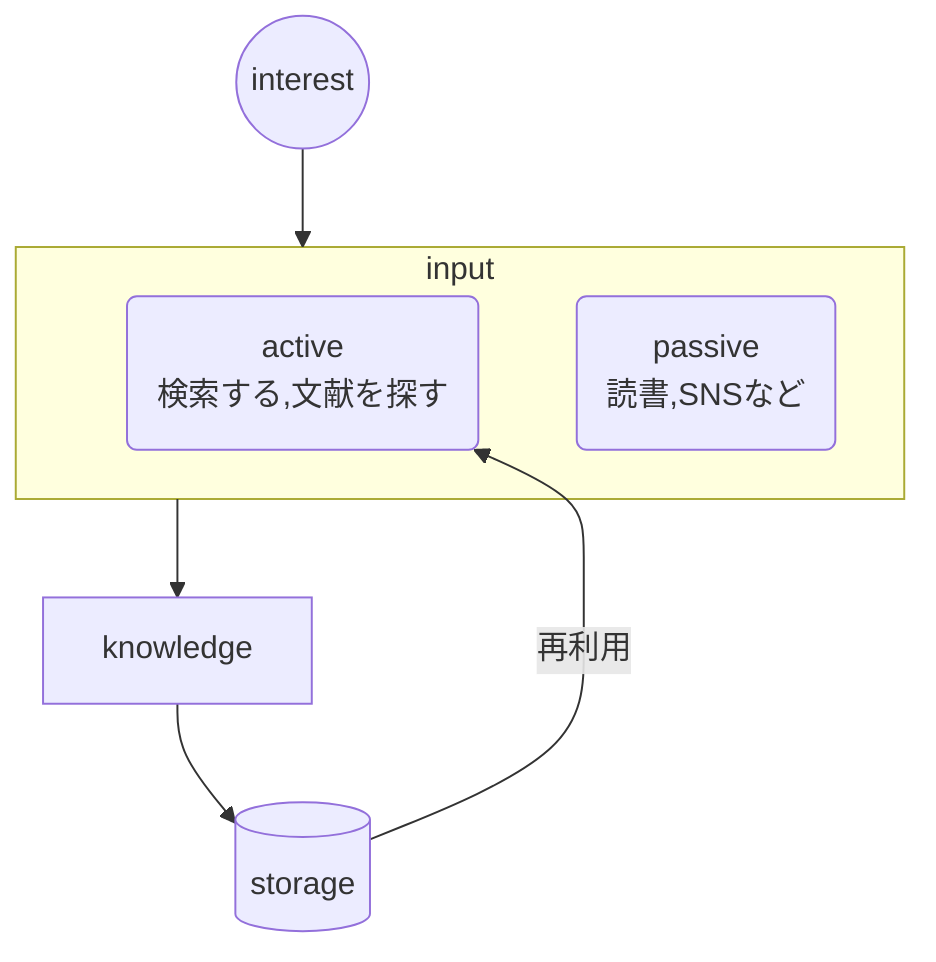
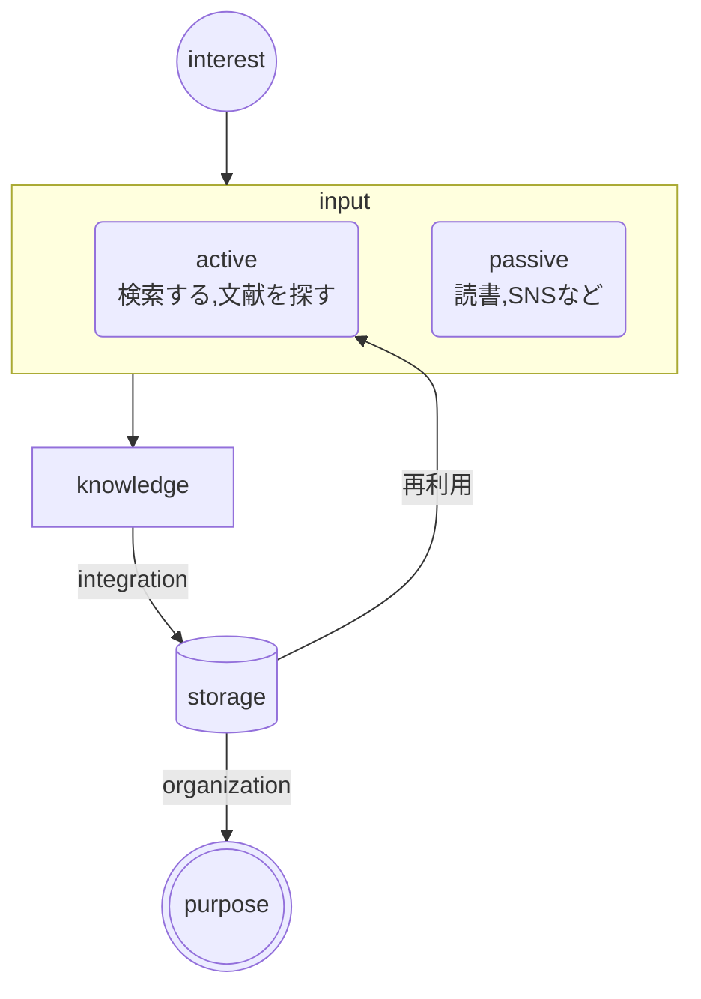
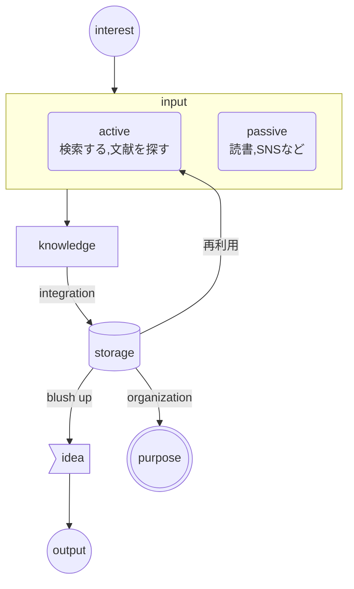

# はじめに

ツールを使い、使われないために、常に目的を考えておきたい。何のためにメモをとったりまとめたりしているのか、その行動がどのプロセスを担っているのか、考えてみた。内容は 100% 自分に内在する発想であって、内容には大いに偏りがあるかもしれない。

# 情報が自分を通り抜けるまで

プロセスを考えてみる。まず、どのような情報が入ってくるのか (どのような情報をいれるのか)。インプットの根源は恐らく興味 (interest)。何でも情報を仕入れているつもりでも無意識下に興味のある内容を選択している。

次に選択された情報を実際にインプットする。特定の情報に対して調べていくような能動的なインプットと、コンテンツを消費するような受動的なインプットがあるだろう。インプットの結果生まれるのは、知識 (Knowledge) である。生データが自分を通り抜けて、精製されたものが初めて Knowledge と呼べると思う。この知識は基本的は自分の脳内に溜まっていくものであるが、外部に Knowledge Storage とでも言うべき貯蓄先があると再利用できる。これがメモの大きな利点だろう。

では、得た知識をどのように貯蓄するのかというのが第一の命題である。雑多な知識を貯蓄すると複数の時間軸の自分たちによる集合知が形成される。現代で最も身近な集合知はなんだろうか。恐らくインターネットである。

ウィキペディア掲載の視覚化した部分的なインターネットマップの図

これを見ると、インターネットの世界はハイパーリンクで網目状に形成されている。現代人は日常的に検索するという行動を取っているが、その度にこのような複雑な情報の海に投げ出されているということになる。しかし、検索してリンクを辿るというだけの操作で割と欲しい情報に辿り着けるように思う。つまり、検索してリンクを辿るというのが集合知を引き出すのに効率いい手法なのだと思う。メモをリンクを貼って、保存する。Obsidian が得意とする方法だ。簡単なルールを作って思考ができるだけ介在しない機械的な情報の統合が望ましいだろう。

このようなやり方は、雑多な整理されていない情報を貯蓄していくのには向いている一方、整理された情報を作るのには向いていない。では、整理された情報がいつ必要か考えると、｢何か目的がある時｣ということになる。私の場合は、｢情報を特定のジャンルでまとめたい｣なら MOC を作るし、｢現在取り組んでいるものを目につくようにしたい｣ならホームページに置くし、｢読んだ文献を確認したい｣なら Dataview で検索できるようにする。つまり、適宜目的に応じた意識的な organization を行っているということになる。これは情報を機械的に統合する段階とは明確に異なっている。

じゃあ目的がなければ知識を貯蓄する必要がないかというと、そういうわけでもない。蓄えた知識は、次の発想につながる可能性があるからだ。複数のメモを元に思考する段階がこの次に存在する。知識がアイディアに昇華されるということだ。私の個人的に好きな方法は

- 自問自答する：自分に質問して自分で答える
- ChatGPT に問いかけ続ける
- Outliner で構造化する
- 日を空けて回数を重ねる

などである。この過程を経て考えが洗練されたり、明確になっていく。このまとまったアイディアは何かしらひと目に付く形でアウトプットしたい。実際にみられるかということより、誰かからアクセスできる状態にするということが大事だと思う。一人で考えたときは凄いことを考えたなと思っても、書き出してみると全然大したことなかったり。

# Obsidian はどこを担うのか

私はメモツールに Obsidian を使っているが、このプロセスを見ると Obsidian が担うべき箇所が見えてくる。というか、インプット以降のプロセスは全部担えてしまうという。考えるべきは

- 知識の統合ルール
- (目的があるなら)organization ルール

くらいか。固まってくるとインプットをどうするが結局大事なようにも思える。

# おわりに

今回の内容は、完全に私の妄想の産物かもしれない。ただ、考えは言語化しないと認識できないと考えているし、たまには脳内会話みたいな内容を書くのもありかなと思った。
